# 前置章节-环境准备

## 环境介绍

1. 学习大数据需要有多台Linux操作系统环境，课程提供2套环境的内容讲解：
基于VMware的本地虚拟机环境
基于阿里云、UCloud的云平台环境
2. 为什么选择两套环境？
VMware、云平台都是开发人员必备技能之一
电脑配置较低或使用M1、M2芯片的Mac电脑，均无法完美的使用虚拟机，云平台是一个很好的替代方案
3. 为什么选择2套云平台？
阿里云最知名，UCloud较小众
了解两个不同体量的平台的使用，未来切换任何云平台都没问题


## VMware准备Linux虚拟机

### 设置VMware网段

在VMware的虚拟网络编辑器中，将VMnet8虚拟网卡的：

网段设置为：192.168.72.0

网关设置为：192.168.72.2

### 下载CentOS操作系统

使用如下链接下载：

https://mirrors.nju.edu.cn/centos/7.9.2009/isos/x86_64/

下载好的 ISO 映像文件：`D:\devtools\mirrors\CentOS-7-x86_64-DVD-2009.iso`

### 在VMware中安装CentOS操作系统


### 配置多台Linux虚拟机

从基础虚拟机(关机状态) 克隆出新虚拟机，右键选择 管理 => 克隆

|                | 虚拟机名称  | 虚拟机位置                   | 固定IP         | 主机名    |
| -------------- | ----------- | ---------------------------- | -------------- | --------- |
| 使用过的虚拟机 | hadoop_base | D:\devtools\vms              | 192.168.72.100 | hadoop100 |
| 新的基础虚拟机 | node0       | D:\devtools\vm\node0         | 192.168.72.200 | hadoop200 |
| 节点1          | node1       | D:\devtools\vm\cluster\node1 | 192.168.72.101 | hadoop101 |
| 节点2          | node2       | D:\devtools\vm\cluster\node2 | 192.168.72.102 | hadoop102 |
| 节点3          | node3       | D:\devtools\vm\cluster\node3 | 192.168.72.103 | hadoop103 |


## VMware虚拟机系统设置

### 主机名、固定IP、SSH免密登录


### JDK环境部署


### 防火墙、SELinux、时间同步


经过一系列操作，我们完成了：

1. 设置三台Linux虚拟机的主机名和固定IP

2. 在Linux系统以及本机系统中配置了主机名映射

3. 配置了三台服务器之间root用户的SSH免密互通

4. 安装配置完成了JDK环境

5. 关闭了防火墙和SELinux

6. 更新了时区和同步了时间

7. 拍摄快照保存状态


## 云平台入门

1. 什么是云平台？
云平台就是一个平台方，聚合了一些软硬件资源对外售卖。
用户可以付费从平台购买如服务器、网络、数据库、存储等各类服务。
2. 主流云平台有哪些？
国内知名的有：阿里云、腾讯云、UCloud等
国外知名的有：AWS、Azure、GCP等
3. 云平台提供的三种服务是哪些？
IaaS：IT基础设施作为服务对外提供
PaaS：平台作为服务对外提供
SaaS：软件作为服务对外提供


## 阿里云

### 阿里云购买云服务器


### 阿里云虚拟机系统设置


## UCloud云

### UCloud云购买虚拟机


### UCloud虚拟机系统设置


# 第一章 - 大数据&分布式

## 数据导论

**数据是什么**

数据：一种可以被鉴别的对客观事件进行记录的符号。对人类的行为及产生的事件的一种记录。

**数据的价值**

丰富的数据支撑，对数据的内容进行深入分析，可以让我们更好的了解事和物在现实世界的运行规律。

比如，购物的订单记录（数据）可以帮助平台更好的了解消费者，从而促进交易。

**大数据时代**

当下时代已经是数据的时代，数据非常重要并且蕴含巨大的价值。

大数据技术栈：对超大规模的数据进行处理并挖掘出数据背后的价值的技术体系。


## 大数据的诞生

- 大数据的诞生和信息化以及互联网的发展是密切相关的。

  - 当全球互联网逐步建成（2000年左右），各大企业或政府单位拥有了海量的数据亟待处理。

  - 基于这个前提逐步诞生了以分布式的形式（即多台服务器集群）完成海量数据处理的处理方式，并逐步发展成现代大数据体系。

- 分布式处理技术：在数据量巨大的基础下，以服务器的数量来解决大规模数据处理问题。

- 分布式服务器集群：用大量的服务器解决大量的数据

  大规模服务器集群下的：大规模数据存储（存）、大规模数据计算（用）、大规模数据传输技术（传）

2008年之前，这些在当时较为”高端”的分布式技术基本上还处于大企业内部专用且不够成熟。

2008年 Apache Hadoop开源，广大企业拥有了成熟的、开源的、分布式数据处理解决方案。

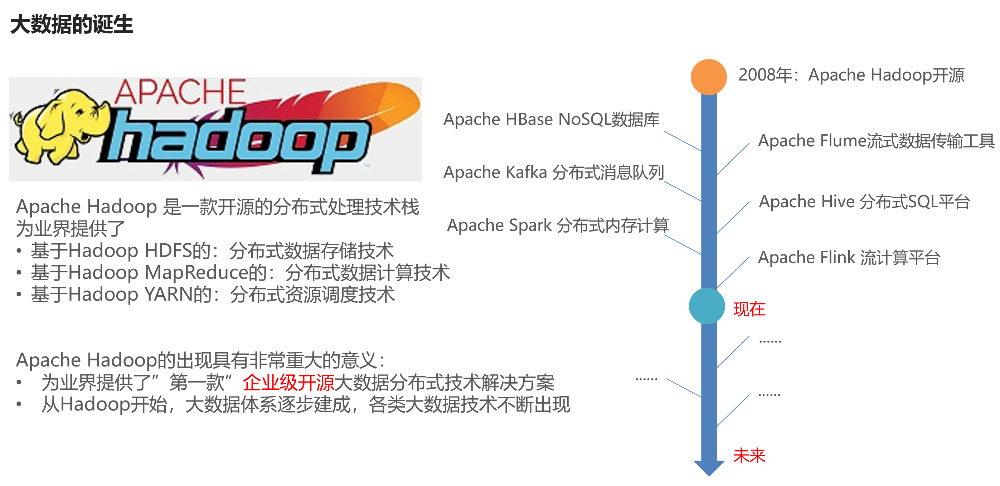


## 大数据概述

**什么是大数据**

狭义上：大数据是一类技术栈，是一种用来处理海量数据的软件技术体系。

广义上：大数据是数字化时代、信息化时代的基础（技术）支撑，以数据为生活赋能。


**大数据的特征**

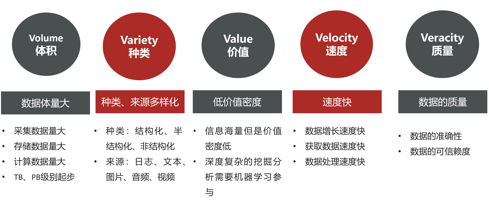


**大数据的核心工作**

- 大数据的核心工作其实就是：从海量的高增长、多类别、低价值密度的数据中挖掘出高质量的结果。

  - 数据存储：妥善保存海量待处理数据

  - 数据计算：完成海量数据的价值挖掘

  - 数据传输：协助各个环节的数据传输

- 后续将学习的技术也是围绕着这三点来进行的，即：分布式存储、分布式计算、海量数据传输


## 大数据软件生态

### 数据存储

Apache Hadoop - HDFS：分布式存储技术

Apache HBase：NoSQL KV型数据库技术，HBase是基于HDFS之上构建的

Apache Kudu：分布式存储引擎

云平台存储组件：如阿里云的OSS、UCloud的US3、AWS的S3、金山云的KS3

### 数据计算

Apache Hadoop - MapReduce：最早一代的大数据分布式计算引擎

Apache Hive：以SQL为主要开发语言的分布式计算框架，其底层使用了Hadoop的MapReduce技术

Apache Spark：分布式内存计算引擎

Apache Flink：分布式内存计算引擎，特别是在实时计算（流计算）领域

### 数据传输

Apache Kafka：分布式的消息系统，可以完成海量规模的数据传输工作

Apache Pulsar：分布式的消息系统

Apache Flume：流式数据采集工具，可以从非常多的数据源中完成数据采集传输的任务

Apache Sqoop：ETL工具，可以协助大数据体系和关系型数据库之间进行数据传输


## Apache Hadoop概述

### 什么是Hadoop

Hadoop是Apache软件基金会下的顶级开源项目，用以提供：分布式数据存储、分布式数据计算、分布式资源调度为一体的整体解决方案。

Apache Hadoop是典型的分布式软件框架，可以部署在1台乃至成千上万台服务器节点上协同工作。

个人或企业可以借助Hadoop构建大规模服务器集群，完成海量数据的存储和计算。

### 为什么学习Hadoop

Hadoop是最早的一批大数据技术框架，在市面上拥有极高的占有率和庞大的用户群体。

Hadoop在大数据体系内，技术难度相对较低，非常适合作为大数据学习的入门技术栈。

### Hadoop的功能

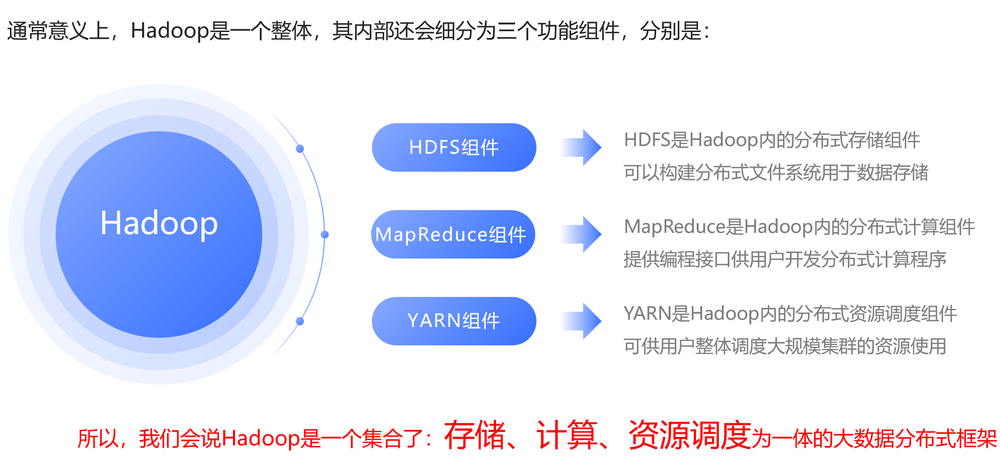

### Hadoop发行版本

Apache 开源社区版（原生版本）：http://hadoop.apache.org/

商业发行版（商业公司二次封装）：CDH、HDP、星环


# 第二章 - Hadoop HDFS

## 为什么需要分布式存储

数据量太大，单机存储能力有上限，需要靠数量来解决问题。

数量的提升带来的是网络传输、磁盘读写、CPU、内存等各方面的综合提升。 分布式组合在一起可以达到1+1>2的效果。


## 分布式的基础架构

大数据体系中，分布式的调度主要有2类架构模式：去中心化模式，中心化模式

去中心化模式：没有明确的中心，众多服务器之间基于特定规则进行同步协调。

中心化模式：有一个中心节点（服务器）来统筹其它服务器的工作，统一指挥，统一调派，避免混乱。这种模式也称为，一主多从模式，简称主从模式（Master And Slaves）

Hadoop框架，就是一个典型的主从模式（中心化模式）架构的技术框架。


## HDFS的基础架构

- HDFS是Hadoop三大组件(HDFS、MapReduce、YARN)之一

  - 全称是：Hadoop Distributed File System（Hadoop分布式文件系统）

  - 是Hadoop技术栈内提供的分布式数据存储解决方案

  - 可以在多台服务器上构建存储集群，存储海量的数据

- HDFS是一个典型的主从模式架构

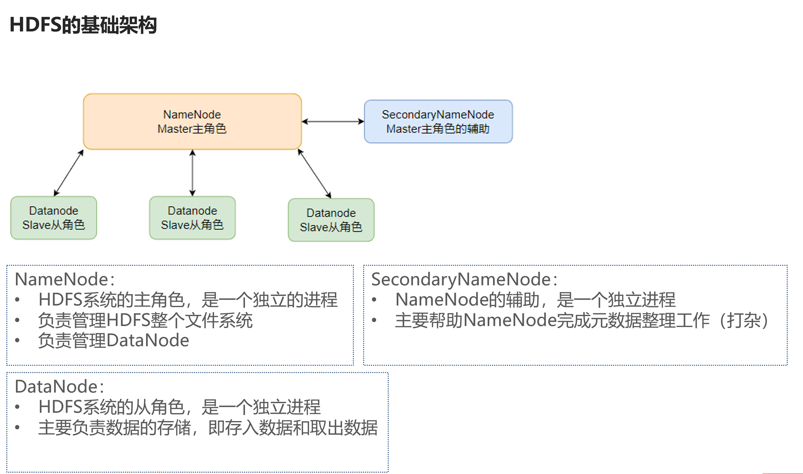

一个典型的HDFS集群，就是由1个NameNode加若干（至少一个）DataNode组成


## HDFS集群环境部署

部署Hadoop的关键点
1. 上传、解压到/export/server，配置软链接
2. 修改4份配置文件
workers
hadoop-env.sh
core-site.xml
hdfs-site.xml
3. 分发到node2、node3，并设置环境变量
4. 创建数据目录，并修改文件权限归属hadoop账户
5. 启动，并查看WEB UI
6. 保存刚刚部署好的状态：虚拟机快照


## HDFS的Shell操作

### 进程启停管理

```sh
# 一键启停脚本 
# 一键启动HDFS集群 $HADOOP_HOME/sbin/start-dfs.sh
start-dfs.sh
# 一键关闭HDFS集群 $HADOOP_HOME/sbin/stop-dfs.sh
stop-dfs.sh

# 单进程启停
# 单独控制所在机器的进程的启停，方式一 $HADOOP_HOME/sbin/hadoop-daemon.sh
hadoop-daemon.sh (start|status|stop) (namenode|secondarynamenode|datanode)
# 方式二 $HADOOP_HOME/bin/hdfs
hdfs --daemon (start|status|stop) (namenode|secondarynamenode|datanode)

```

### 文件系统操作命令

关于HDFS文件系统的操作命令，Hadoop提供了2套命令体系

```sh
hadoop fs
hdfs dfs
```

文件系统协议包括

```sh
# Linux本地文件系统 file:// 
file:///usr/local/hello.txt
# HDFS文件系统 hdfs://namenode_server:port 
hdfs://node1:8020/usr/local/hello.txt

# 协议头 file:// 或 hdfs://node1:8020 可以省略
```

常用命令

```sh
# 创建文件夹 mkdir
# path 为待创建的目录
# -p 它会沿着路径创建父目录
hadoop fs -mkdir [-p] <path> ...
hdfs dfs -mkdir [-p] <path> ...


# 查看指定目录下内容 ls
# path 指定目录路径
# -h 人性化显示文件size
# -R 递归查看指定目录及其子目录
hdfs dfs -ls [-h] [-R] [<path> ...] 


# 上传文件到HDFS指定目录下 put
# -f 覆盖目标文件（已存在下）
# -p 保留访问和修改时间，所有权和权限
# localsrc 本地文件系统（客户端所在机器）
# dst 目标文件系统（HDFS）
hdfs dfs -put [-f] [-p] <localsrc> ... <dst>


# 查看HDFS文件内容 cat 
hdfs dfs -cat <src> ...
# 读取大文件可以使用管道符配合more
hdfs dfs -cat <src> | more


# 下载HDFS文件到本地文件系统指定目录 get
# localdst必须是目录
# -f 覆盖目标文件（已存在下）
# -p 保留访问和修改时间，所有权和权限
hdfs dfs -get [-f] [-p] <src> ... <localdst>


# 拷贝HDFS文件 cp
# -f 覆盖目标文件（已存在下）
hdfs dfs -cp [-f] <src> ... <dst>


# 追加数据到HDFS文件中 appendToFile
# 将所有给定本地文件的内容追加到给定dst文件
# dst如果文件不存在，将创建该文件
# 如果<localSrc>为-，则输入为从标准输入中读取
hdfs dfs -appendToFile <localsrc> ... <dst>


# HDFS移动文件到指定文件夹下 mv
# 可以使用该命令移动数据，重命名文件的名称
hdfs dfs -mv <src> ... <dst>


# HDFS删除指定路径的文件或文件夹
# -skipTrash 跳过回收站，直接删除
# 回收站功能默认关闭，如果要开启需要在core-site.xml内配置
# 回收站默认位置在 hdfs://node1:8020/user/用户名(hadoop)/.Trash
hdfs dfs -rm -r [-skipTrash] URI [URI ...]

```

命令官方指导文档

https://hadoop.apache.org/docs/r3.3.4/hadoop-project-dist/hadoop-common/FileSystemShell.html

常见的操作自己最好能够记住，其他操作可以根据需要查询文档使用。

### HDFS权限

- HDFS中，也是有权限控制的，其控制逻辑和Linux文件系统的完全一致。

- 但是不同的是，大家的Superuser不同（超级用户不同）

  Linux的超级用户是root

  HDFS文件系统的超级用户：是启动namenode的用户（也就是课程的hadoop用户）

- 请确保你的HDFS操作命令是以：hadoop用户执行的，root用户在HDFS上其实没特权。

```sh
# 在HDFS中，可以使用和Linux一样的授权语句，即：chown和chmod
# 修改所属用户和组：
hdfs dfs -chown [-R] root:root /xxx.txt
# 修改权限
hdfs dfs -chmod [-R] 777 /xxx.txt

```

### HDFS客户端 - Jetbrians产品插件

在 JetBrains 产品中安装使用 `Big Data Tools` 插件

### HDFS客户端 - NFS


## HDFS的存储原理

### HDFS分布式文件存储

分布式存储：每个服务器（节点）存储文件的一部分

问题：文件大小不一，不利于统一管理

解决：设定统一的管理单位，Block块

​			Block块，HDFS最小存储单位。每个256MB（可以修改）

文件分成多个Block块，Block块分三份存入对应服务器

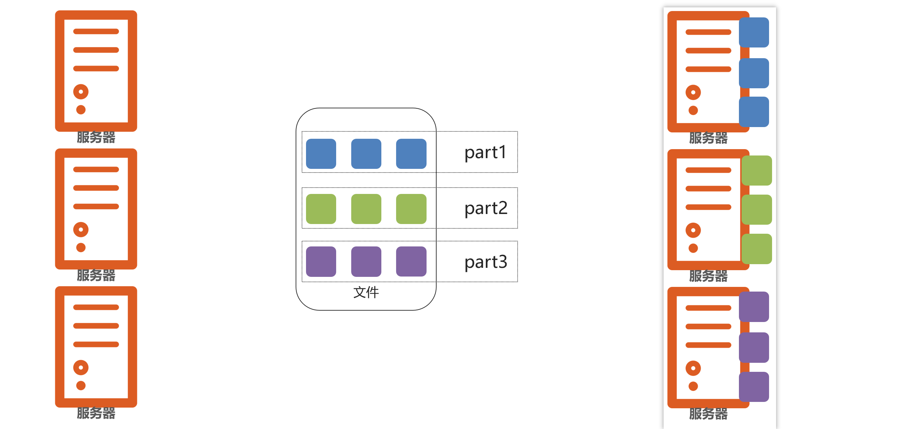


问题：如果丢失或损坏了某个Block块呢？

​			丢失一个Block块就导致文件不完整了。Block块越多，损坏的几率越大

解决：通过多个副本（备份）解决

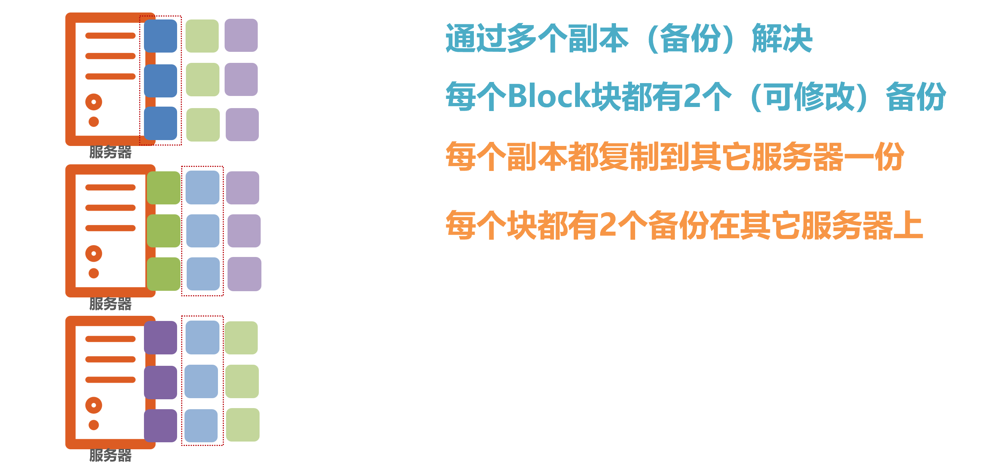


**总结**

数据存入HDFS是分布式存储，即每一个服务器节点，负责数据的一部分。

数据在HDFS上是划分为一个个Block块进行存储。

在HDFS上，数据Block块可以有多个副本，提高数据安全性。


### fsck命令

**配置HDFS数据块的副本数量**

如何设置默认文件上传到HDFS中拥有的副本数量？在 `hdfs-site.xml` 中配置如下属性：

```xml
<!-- 配置副本数，默认3 -->
<property>
    <name>dfs.replication</name>
    <value>3</value>
</property>

<!-- 修改每一台服务器的 hdfs-site.xml 文件 -->
```

```sh
# 除了配置文件外，还可以在上传文件的时候，临时决定被上传文件以多少个副本存储。
hadoop fs -D dfs.replication=2 -put test.txt /tmp/

# 对于已经存在HDFS的文件，修改dfs.replication属性不会生效，如果要修改已存在文件可以通过命令
hadoop fs -setrep [-R] 2 path
# 如上命令，指定path的内容将会被修改为2个副本存储
# -R选项可选，使用-R表示对子目录也生效

```

**fsck命令查看文件系统状态及验证文件的数据副本**

```sh
# 使用hdfs提供的fsck命令来检查文件的副本数
hdfs fsck path [-files [-blocks [-locations]]]
# fsck可以检查指定路径是否正常
# -files可以列出路径内的文件状态
# -files -blocks  输出文件块报告（有几个块，多少副本）
# -files -blocks -locations 输出每一个block的详情

```

**block配置**

```xml
<!-- Block块大小，默认设置为256MB，也就是1GB文件会被划分为4个block存储 -->
<property>
    <name>dfs.blocksize</name>
    <value>268435456</value>
    <description>设置HDFS块大小，单位是b</description>
</property>

```


### NameNode元数据

在hdfs中，文件是被划分了一堆堆的block块，那如果文件很大、以及文件很多，Hadoop是如何记录和整理文件和block块的关系呢？

NameNode基于一批edits和一个fsimage文件的配合，完成整个文件系统的管理和维护


**edits文件**：是一个流水账文件，记录了hdfs中的每一次操作，以及本次操作影响的文件其对应的block

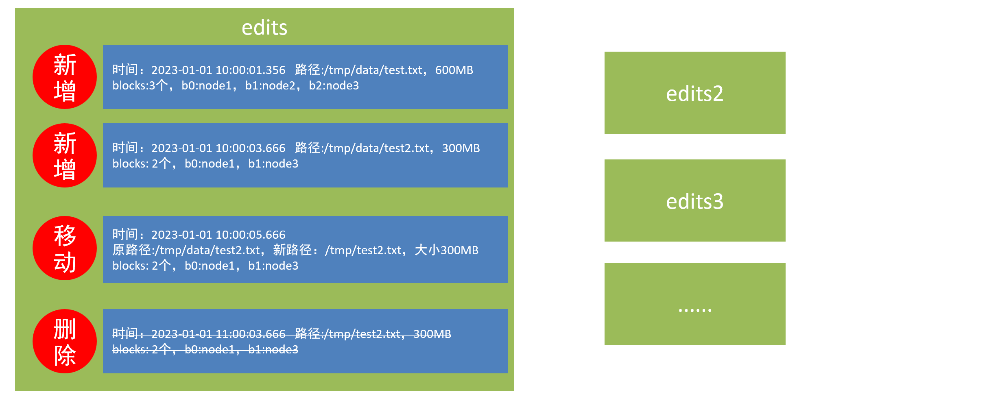

**fsimage文件**：将全部的edits文件，合并为最终结果，即可得到一个FSImage文件

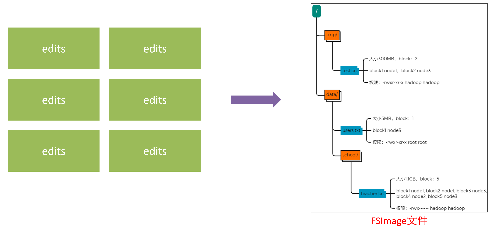

**NameNode元数据管理维护**

NameNode基于edits和FSImage的配合，维护整个文件系统元数据。

- edits 记录每次操作

- fsimage 记录某一个时间节点前的当前文件系统全部文件的状态和信息

- edits 文件会被合并到 fsimage 中，合并元数据由 SecondaryNameNode 来操作

  - SecondaryNameNode 会通过 http 从 NameNode 拉取数据（edits 和 fsimage），合并完成后提供给NameNode 使用
  - 元数据合并控制参数

- 具体流程

  1. 每次对HDFS的操作，均被edits文件记录

  2. edits达到大小上限后，开启新的edits记录

  3. 定期进行edits的合并操作
     如当前没有fsimage文件，  将全部edits合并为第一个fsimage
     如当前已存在fsimage文件，将全部edits和已存在的fsimage进行合并，形成新的fsimage

  4. 重复123流程


### HDFS数据的读写流程

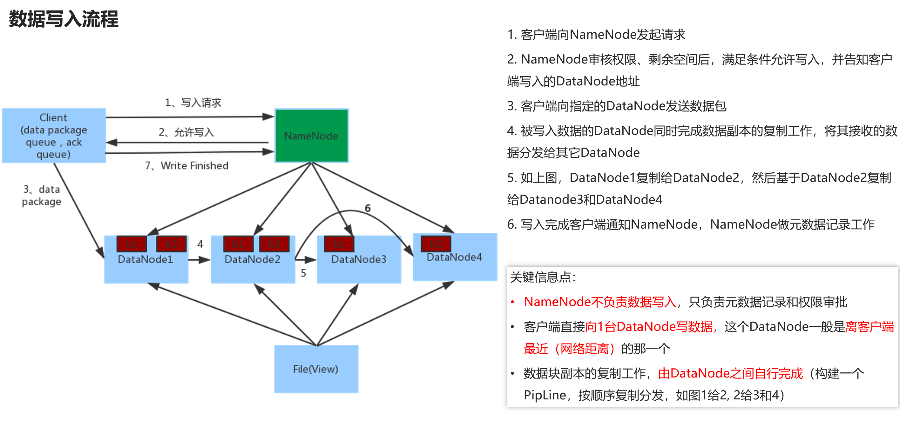


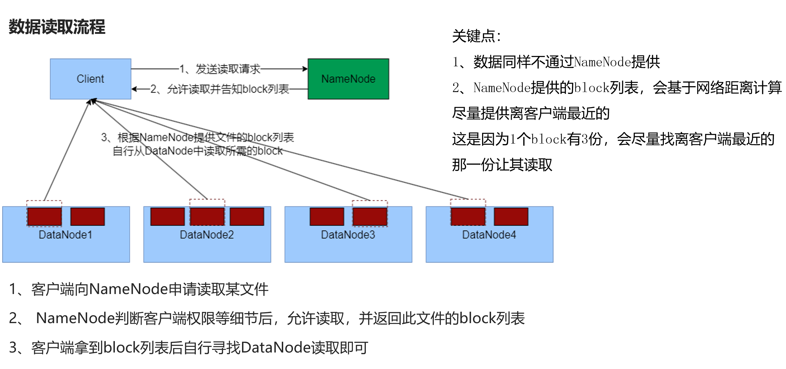


**总结**

1. 对于客户端读取HDFS数据的流程中，一定要知道
   不论读、还是写，NameNode都不经手数据，均是客户端和DataNode直接通讯
   不然对NameNode压力太大

2. 写入和读取的流程，简单来说就是：
   NameNode做授权判断（是否能写、是否能读）
   客户端直连DataNode进行写入（由DataNode自己完成副本复制）、客户端直连DataNode进行block读取
   写入，客户端会被分配找离自己最近的DataNode写数据
   读取，客户端拿到的block列表，会是网络距离最近的一份
3. 网络距离
   最近的距离就是在同一台机器
   其次就是同一个局域网（交换机）
   再其次就是跨越交换机
   再其次就是跨越数据中心
   HDFS内置网络距离计算算法，可以通过IP地址、路由表来推断网络距离


# 第三章 - MapReduce & YARN

## 分布式计算概述

1. 什么是计算、分布式计算？
计算：对数据进行处理，使用统计分析等手段得到需要的结果
分布式计算：多台服务器协同工作，共同完成一个计算任务
2. 分布式计算常见的2种工作模式
分散->汇总  （MapReduce就是这种模式）
中心调度->步骤执行 （大数据体系的Spark、Flink等是这种模式）


## MapReduce概述

1. 什么是MapReduce
MapReduce是Hadoop中的分布式计算组件
MapReduce可以以分散->汇总（聚合）模式执行分布式计算任务
2. MapReduce的主要编程接口
map接口，主要提供“分散”功能，由服务器分布式处理数据
reduce接口，主要提供“汇总”功能，进行数据汇总统计得到结果
MapReduce可供Java、Python等语言开发计算程序
注：MapReduce尽管可以通过Java、Python等语言进行程序开发，但当下年代基本没人会写它的代码了，因为太过时了。尽管MapReduce很老了，但现在仍旧活跃在一线，主要是Apache Hive框架非常火，而Hive底层就是使用的MapReduce。 所以对于MapReduce的代码开发，课程会简单扩展一下，但不会深入讲解，对MapReduce的底层原理会放在Hive之后，基于Hive做深入分析。

3. MapReduce的运行机制
将要执行的需求，分解为多个Map Task和Reduce Task
将Map Task 和 Reduce Task分配到对应的服务器去执行


## YARN概述

**资源调度**

资源：服务器硬件资源，如：CPU、内存、硬盘、网络等

资源调度：管控服务器硬件资源，提供更好的利用率

分布式资源调度：管控整个分布式服务器集群的全部资源，整合进行统一调度

对于资源的利用，有规划、有管理的调度资源使用，是效率最高的方式。在程序中亦是如此

**程序的资源调度**

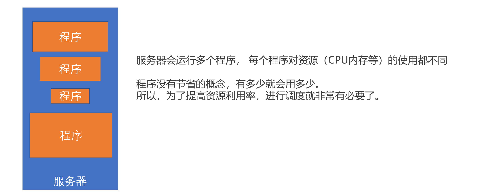


**YARN的资源调度**

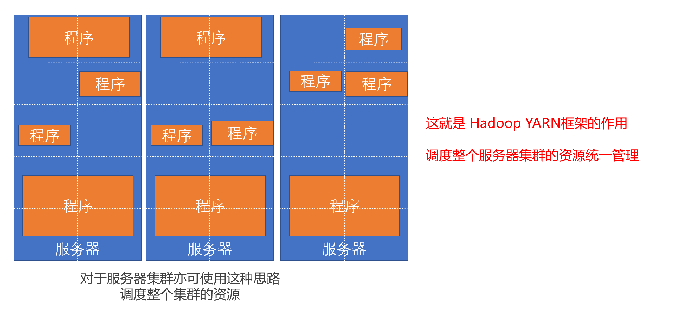

YARN 管控整个集群的资源进行调度， 那么应用程序在运行时，就是在YARN的监管（管理）下去运行的。

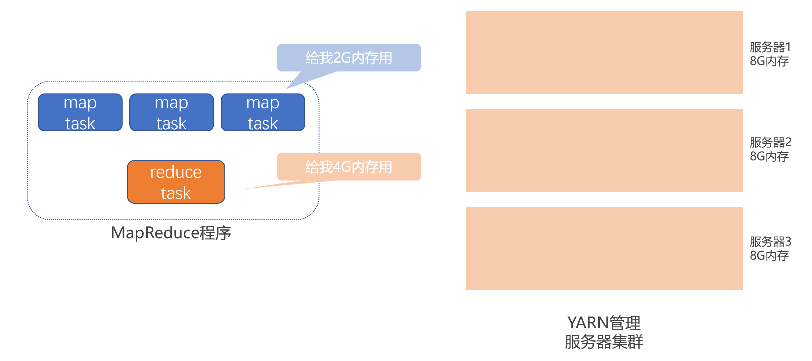

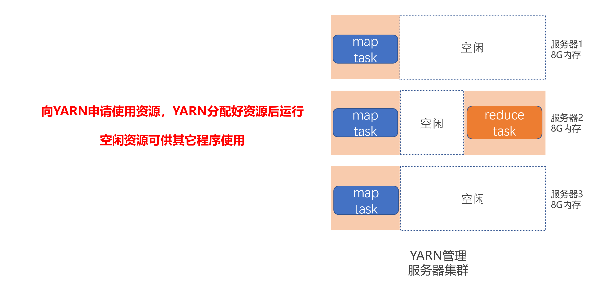

**总结**

1. YARN是做什么的？
YARN是Hadoop的一个组件
用以做集群的资源（内存、CPU等）调度
2. 为什么需要资源调度
将资源统一管控进行分配可以提高资源利用率
3. 程序如何在YARN内运行
程序向YARN申请所需资源
YARN为程序分配所需资源供程序使用
4. MapReduce和YARN的关系
YARN用来调度资源给MapReduce分配和管理运行资源
所以，MapReduce需要YARN才能执行（普遍情况）


## YARN架构

### 核心架构

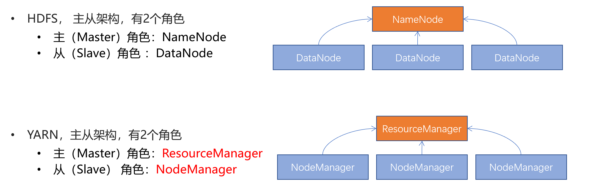


ResourceManager：整个集群的资源调度者， 负责协调调度各个程序所需的资源。

NodeManager：单个服务器的资源调度者，负责调度单个服务器上的资源提供给应用程序使用。

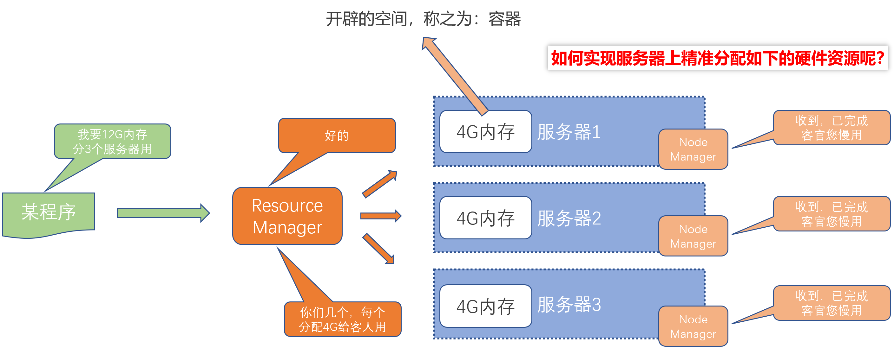

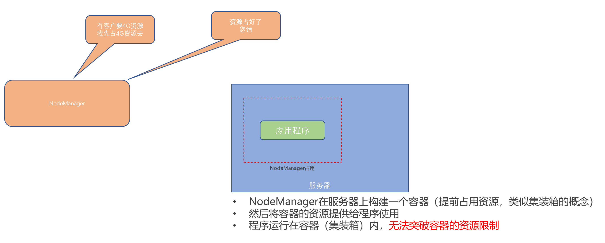

**总结**

1. YARN的架构有哪2个角色？
主（Master）：ResourceManager
从（Slave）：NodeManager
2. 两个角色各自的功能是什么？
ResourceManager： 管理、统筹并分配整个集群的资源
NodeManager：管理、分配单个服务器的资源，即创建管理容器，由容器提供资源供程序使用
3. 什么是YARN的容器？
容器（Container）是YARN的NodeManager在所属服务器上分配资源的手段
创建一个资源容器，即由NodeManager占用这部分资源
然后应用程序运行在NodeManager创建的这个容器内
应用程序无法突破容器的资源限制
ps：容器是虚拟化的相关机制，后续我们会详细讲解

### 辅助架构

- YARN的架构中除了**核心角色**，即：
  - ResourceManager：集群资源总管家
  - NodeManager：单机资源管家

- 还可以搭配2个**辅助角色**使得YARN集群运行更加稳定
  - 代理服务器(ProxyServer)：Web Application Proxy Web应用程序代理
  - 历史服务器(JobHistoryServer)： 应用程序历史信息记录服务


## YARN集群部署

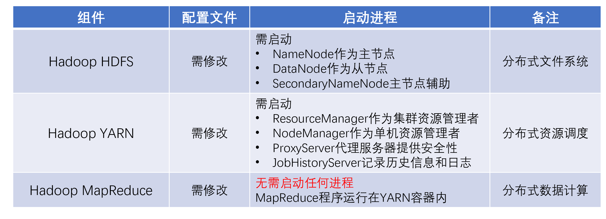

**YARN集群规划**

有3台服务器，其中node1配置较高

| 主机  | 角色                                                         |
| ----- | ------------------------------------------------------------ |
| node1 | ResourceManager<br/>NodeManager<br/>ProxyServer<br/>JobHistoryServer |
| node2 | NodeManager                                                  |
| node3 | NodeManager                                                  |

**MapReduce配置文件**

mapred-env.sh	mapred-site.xml

**YARN配置文件**

yarn-env.sh	yarn-site.xml

**分发配置文件**

MapReduce和YARN的配置文件修改好后，需要分发到其它的服务器节点中。

**启动YARN集群的相关进程**

```sh
# 一键启动YARN集群： 
$HADOOP_HOME/sbin/start-yarn.sh
# 从yarn-site.xml中读取配置，确定ResourceManager所在机器，并启动它
# 读取workers文件，确定机器，启动全部的NodeManager
# 在当前机器启动ProxyServer（代理服务器）


# 一键停止YARN集群： 
$HADOOP_HOME/sbin/stop-yarn.sh


# 在当前机器，单独启动或停止进程
$HADOOP_HOME/bin/yarn --daemon start|stop resourcemanager|nodemanager|proxyserver
# start和stop决定启动和停止
# 可控制resourcemanager、nodemanager、proxyserver三种进程


# 历史服务器启动和停止
$HADOOP_HOME/bin/mapred --daemon start|stop historyserver

```

**查看YARN的WEB UI页面**

打开 http://node1:8088 即可看到YARN集群的监控页面（ResourceManager的WEB UI）

**给虚拟机打上快照，保存安装状态**


## MapReduce & YARN 初体验

提交MapReduce任务到YARN执行


# 第四章 - Hive 入门

## Apache Hive 概述

1. 什么是分布式SQL计算？
以分布式的形式，执行SQL语句，进行数据统计分析。
2. Apache Hive是做什么的？
将SQL语句翻译成MapReduce程序，从而提供用户分布式SQL计算的能力。
传统MapReduce开发：写MR代码->得到结果
使用Hive开发：写SQL->得到结果
底层都是MR在运行，但是使用层面上更加简单了。


## 模拟实现Hive功能

- 设计Hive这款软件，要求能够实现
  用户只编写sql语句
  Hive自动将sql转换MapReduce程序并提交运行
  处理位于HDFS上的结构化数据。

- 基于MapReduce构建分布式SQL执行引擎，主要需要有哪些功能组件？
  元数据管理
  SQL解析器


## Hive基础架构

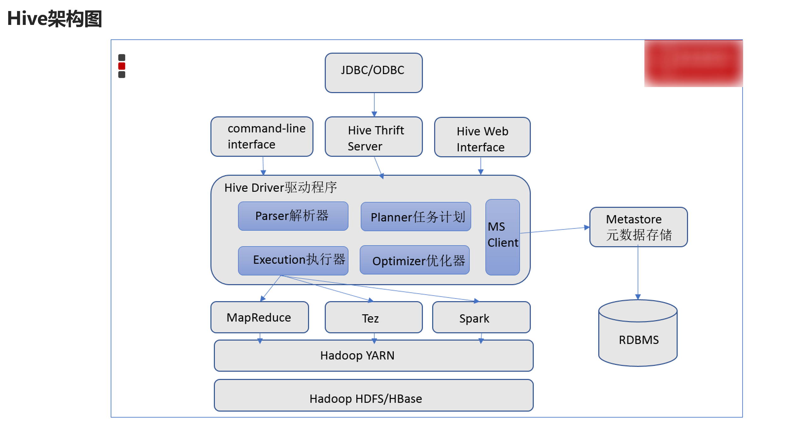

**Hive组件**

- 元数据存储
  - 通常是存储在关系数据库如 mysql/derby 中。Hive 中的元数据包括表的名字，表的列和分区及其属性，表的属性（是否为外部表等），表的数据所在目录等。
  - Hive 提供了 Metastore 服务进程提供元数据管理功能
- Driver驱动程序，包括语法解析器、计划编译器、优化器、执行器
  - 完成 HQL 查询语句从词法分析、语法分析、编译、优化以及查询计划的生成。生成的查询计划存储在 HDFS 中，并在随后由执行引擎调用执行。
  - 这部分内容不是具体的服务进程，而是封装在Hive所依赖的Jar文件即Java代码中。
- 用户接口
  - 包括 CLI、JDBC/ODBC、WebGUI。其中，CLI(command line interface)为shell命令行；Hive中的Thrift服务器允许外部客户端通过网络与Hive进行交互，类似于JDBC或ODBC协议。WebGUI是通过浏览器访问Hive。
  - Hive提供了 Hive Shell、 ThriftServer等服务进程向用户提供操作接口


## Hive部署

部署Hive的主要流程：

1. 部署MySQL数据库，并配置root账户密码

2. 下载Hive上传并解压和设置软链接

3. 下载MySQL 驱动jar包放入Hive的lib目录内

4. 修改配置文件（hive-env.sh和hive-site.xml）

5. 初始化元数据库（bin/schematool -initSchema -dbType mysql -verbos）

6. 启动hive的metastore服务：
   前台启动：bin/hive --service metastore
   后台启动：nohup bin/hive --service metastore >> logs/metastore.log 2>&1 &

7. 启动hive命令行：bin/hive


## Hive初体验

1. Hive中可以使用类MySQL的SQL语法完成基本的库、表、插入、查询等操作
2. 通过YARN控制台可以看到，Hive是将SQL翻译成MapReduce程序运行在YARN中
3. Hive中创建的库和表的数据，存储在HDFS中，默认存放在：hdfs://node1:8020/user/hive/warehouse 中


## Hive客户端

### HiveServer2

在启动Hive的时候，除了必备的Metastore服务外，我们前面提过有2种方式使用Hive：

```sh
# 启动hive的metastore服务
# 前台启动
bin/hive --service metastore
# 后台启动
nohup bin/hive --service metastore >> logs/metastore.log 2>&1 &

# 启动HiveServer2服务
# 方式1：即Hive的Shell客户端，可以直接写SQL
bin/hive
# 方式2
bin/hive --service hiveserver2
# 后台执行脚本
nohup bin/hive --service hiveserver2 >> logs/hiveserver2.log 2>&1 &
```

HiveServer2是Hive内置的一个ThriftServer服务，对外提供Thrift端口（默认端口10000）可供其它客户端链接。可以连接ThriftServer的客户端有：
Hive内置的 beeline客户端工具（命令行工具）
第三方的图形化SQL工具，如DataGrip、DBeaver、Navicat等

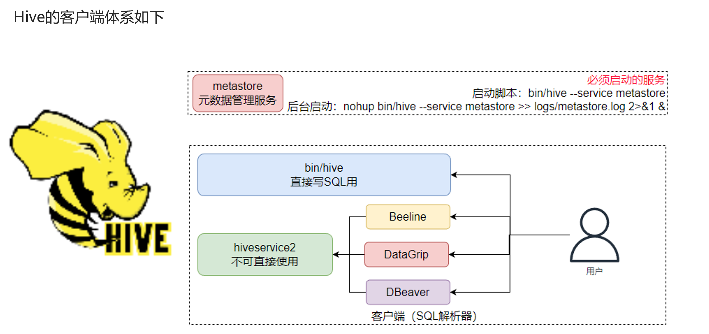

在hive安装的服务器上，首先启动metastore服务，然后启动hiveserver2服务。

```sh
nohup bin/hive --service metastore >> logs/metastore.log 2>&1 &
nohup bin/hive --service hiveserver2 >> logs/hiveserver2.log 2>&1 &
```

### Hive内置客户端-Beeline

在node1上使用beeline客户端进行连接访问。需要注意hiveserver2服务启动之后需要稍等一会才可以对外提供服务。

Beeline是JDBC的客户端，通过JDBC协议和Hiveserver2服务进行通信，协议的地址是：jdbc:hive2://node1:10000

### Hive第三方客户端

DataGrip、Dbeaver、SQuirrel SQL Client等
可以在Windows、MAC平台中通过JDBC连接HiveServer2的图形界面工具；
这类工具往往专门针对SQL类软件进行开发优化、页面美观大方，操作简洁，更重要的是SQL编辑环境优雅；
SQL语法智能提示补全、关键字高亮、查询结果智能显示、按钮操作大于命令操作。


# 第五章 - Hive 语法与概念

## 数据库操作

```sql
-- 创建库
CREATE DATABASE [IF NOT EXISTS] db_name [LOCATION 'path'] [COMMENT database_comment];

-- 删除库
DROP DATABASE [IF EXISTS] db_name [CASCADE];
```

- 数据库和 HDFS 的关系
  - Hive 的库在 HDFS 上就是一个以 .db 结尾的目录
  - 默认存储在：/user/hive/warehouse
  - 可以通过 LOCATION 关键字在创建的时候指定存储目录


## 数据表操作

### 表操作语法和数据类型

**创建表**

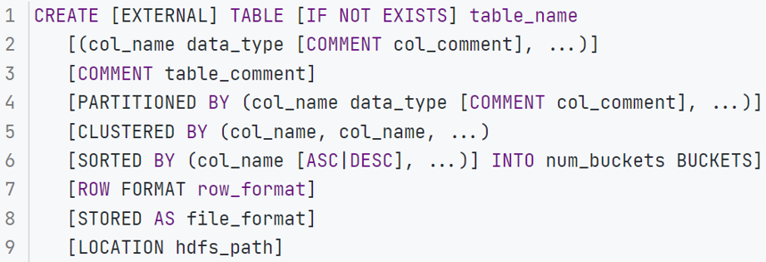

EXTERNAL，创建外部表

PARTITIONED BY， 分区表

CLUSTERED BY，分桶表

STORED AS，存储格式

LOCATION，存储位置

**删除表**

```sql
-- 删除表
DROP TABLE [IF EXISTS] table_name;
```


### 内部表

**内部表和外部表对比**

|        | 创建                         | 存储位置                            | 删除数据                         | 理念                 |
| ------ | ---------------------------- | ----------------------------------- | -------------------------------- | -------------------- |
| 内部表 | CREATE TABLE ......          | Hive管理，默认 /user/hive/warehouse | 删除元数据（表信息），删除数据   | Hive管理表，持久使用 |
| 外部表 | CREATE EXTERNAL TABLE ...... | 随意，LOCATION关键字指定            | 仅删除元数据（表信息），保留数据 | 临时链接外部数据用   |

**创建内部表**

```sql
-- 标准的创建语法
CREATE TABLE table_name
-- 基于查询结果建表
CREATE TABLE table_name as
create table stu3 as select * from stu2;
-- 基于已存在的表结构建表
CREATE TABLE table_name like
create table stu4 like stu2;
-- 查看表类型和详情
DESC FORMATTED table_name
DESC FORMATTED stu2;

-- 在创建表的时候修改字段分隔符
create table if not exists stu2(id int ,name string) row format delimited fields terminated by '\t';

-- 删除内部表，表信息以及表数据全部都被删除
DROP TABLE table_name

```

**Hive的字段分隔符**

默认是特殊字符：’\001’

可以通过 `row format delimited fields terminated by` 在创建表的时候修改


### 外部表

```sql
-- 创建外部表语法：
CREATE EXTERNAL TABLE ......
-- 必须使用 row format delimited fields terminated by 指定列分隔符
-- 必须使用 LOCATION 指定数据路径
```

**外部表和其数据是相互独立的**， 即：

- 可以先有表，然后把数据移动到表指定的 LOCATION 中

- 也可以先有数据，然后创建表通过 LOCATION 指向数据

- 表和数据只是一个链接关系

- 所以删除表，表不存在了但数据保留

```sh
# 1. 在Linux上创建新文件，test_external.txt，并填入如下内容：数据列用’\t’分隔
1	itheima
2	itcast
3	hadoop

 
# 2. 演示先创建外部表，然后移动数据到LOCATION目录
# 首先检查：hadoop fs -ls /tmp，确认不存在 /tmp/test_ext1 目录
# 创建外部表：
create external table test_ext1(id int, name string) row format delimited fields terminated by ‘\t’ location ‘/tmp/test_ext1’;
# 可以看到，目录 /tmp/test_ext1 被创建
# select * from test_ext1，空结果，无数据
# 上传数据： 
hadoop fs -put test_external.txt /tmp/test_ext1/ 
# select * from test_ext1，即可看到数据结果


# 3. 演示先存在数据，后创建外部表
hadoop fs -mkdir /tmp/test_ext2
hadoop fs -put test_external.txt /tmp/test_ext2/

create external table test_ext2(id int, name string) row format delimited fields terminated by ‘\t’ location ‘/tmp/test_ext2’;
select * from test_ext2;

```

**删除外部表**

```sql
DROP TABLE table_name
-- 在Hive中通过show table，表不存在了，但是在HDFS中，数据文件依旧保留
-- 即，删除外部表，仅删除元数据（表结构表信息）、保留数据
```

**内外部表转换**

```sql
-- 查看表类型和详情
DESC FORMATTED table_name

-- 内外部表转换，通过 set tblproperties 来修改属性
-- 内部表转外部表
alter table stu set tblproperties('EXTERNAL'='TRUE');
-- 外部表转内部表
alter table stu set tblproperties('EXTERNAL'='FALSE');

-- 要注意：('EXTERNAL'='FALSE') 或 ('EXTERNAL'='TRUE')为固定写法，区分大小写！！！
```


### 数据加载和导出

> 为什么要加载数据而非使用外部表？
>
> 外部表是临时使用的，重要数据建议存入内部表进行管理。
>
> 1. 外部表就像企业的外聘顾问一样，并非正式成员，在设计上只是临时工，一般用于中转数据或临时使用。
>
> 2. 外部表存储位置不固定，权限管控不统一，容易出现数据丢失问题。
>
> 所以，我们需要学习数据加载，完成将外部数据导入到Hive内部表中。

**数据加载 - LOAD 语法**

```sql
LOAD DATA [LOCAL] INPATH 'filepath' [OVERWRITE] INTO TABLE tablename;

-- 数据来源本地，本地数据文件会保留，本质是本地文件上传到HDFS
-- 数据来自HDFS，加载后源数据文件会消失，本质是在HDFS上进行文件移动，被移动到表所在的目录中
```

**数据加载 - INSERT SELECT 语法**

```sql
INSERT [OVERWRITE | INTO] TABLE tablename1 [PARTITION (partcol1=val1, partcol2=val2 ...) [IF NOT EXISTS]] select_statement1 FROM from_statement;

-- 将SELECT查询语句的结果插入到其它表中，被SELECT查询的表可以是内部表或外部表。
```

**数据加载 - 两种语法的选择**

- 数据在本地
  - 推荐 load data local 加载
- 数据在 HDFS
  - 如果不保留原始文件：推荐使用 LOAD 方式直接加载
  - 如果保留原始文件：推荐使用外部表先关联数据，然后通过 INSERT SELECT 外部表的形式加载数据
- 数据已经在表中
  - 只可以 INSERT SELECT

**hive表数据导出 - insert overwrite 方式**

将hive表中的数据导出到其他任意目录，例如linux本地磁盘，例如hdfs，例如mysql等

```sql
-- 语法
insert overwrite [local] directory ‘path’ select_statement1 FROM from_statement;

-- 将查询的结果导出到本地 - 使用默认列分隔符
insert overwrite local directory '/home/hadoop/export1' select * from test_load ;

-- 将查询的结果导出到本地 - 指定列分隔符
insert overwrite local directory '/home/hadoop/export2' row format delimited fields terminated by '\t' select * from test_load;

-- 将查询的结果导出到HDFS上(不带local关键字)
insert overwrite directory '/tmp/export' row format delimited fields terminated by '\t' select * from test_load;
```

**hive表数据导出 - hive shell 方式**

```sh
# 基本语法：（hive -e/-f 执行语句或者脚本 > file）
bin/hive -e "select * from myhive.test_load;" > /home/hadoop/export3/export3.txt
bin/hive -f export.sql > /home/hadoop/export4/export4.txt
```


### 分区表

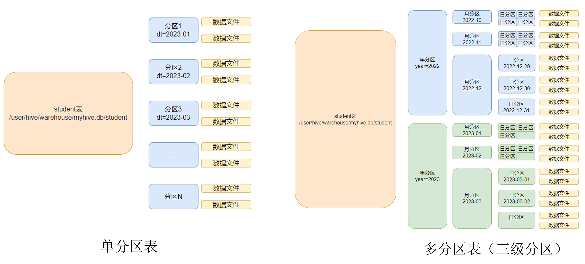


```sql
-- 创建分区表
CREATE TABLE tablename(id int) COMMENT 'partitioned table' PARTITIONED BY(year string, month string, day string) ROW FORMAT DELIMITED FIELDS TERMINATED BY '\t';
-- 分区表的分区列，在partitioned by 中定义，不在普通列中定义

-- 加载数据到分区表中
LOAD DATA [LOCAL] INPATH 'filepath' INTO TABLE tablename PARTITION(year='2020', month='06', day='01',);

-- 查看分区
SHOW PARTITIONS tablename;

-- 添加分区
ALTER TABLE tablename ADD PARTITION (partition_key='partition_value', ....);

-- 删除分区
ALTER TABLE tablename DROP PARTITION (partition_key='partition_value');

```

1. 什么是分区表？
可以选择字段作为表分区
分区其实就是HDFS上的不同文件夹
分区表可以极大的提高特定场景下Hive的操作性能
2. 分区表的语法
create table tablename(...) partitioned by (分区列 列类型, ...) row format delimited fields terminated by '';
分区表的分区列，在partitioned by 中定义，不在普通列中定义


### 分桶表

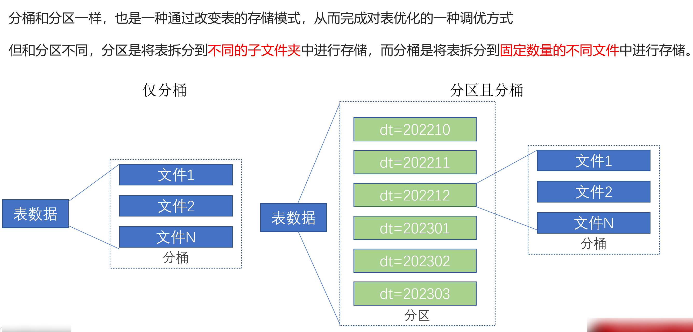


```sql
-- 开启分桶的自动优化（自动匹配reduce task数量和桶数量一致）
set hive.enforce.bucketing=true;

-- 创建分桶表
CREATE TABLE course (c_id string,c_name string,t_id string) CLUSTERED BY(c_id) INTO 3 BUCKETS ROW FORMAT DELIMITED FIELDS TERMINATED BY '\t';

-- 加载数据到分桶表中
-- 由于桶表的数据加载通过 load data 无法执行，只能通过 insert select. 所以，比较好的方式是
-- 1. 创建一个临时表（外部表或内部表均可），通过 load data 加载数据进入表
-- 2. 然后通过 insert select 从临时表向桶表插入数据
-- 创建普通表
CREATE TABLE course_common (c_id string,c_name string,t_id string) ROW FORMAT DELIMITED FIELDS TERMINATED BY '\t';
-- 普通表中加载数据
LOAD DATA [LOCAL] INPATH 'filepath' INTO TABLE course_common;
-- 通过 insert select 给桶表中加载数据
INSERT [OVERWRITE | INTO] TABLE course SELECT * FROM course_common CLUSTER BY(c_id);

```

1. 什么是分桶表？
可以选择字段作为分桶字段
分桶表本质上是数据分开在不同的文件中
分区和分桶可以同时使用
2. 分桶表的语法
通过clustered by(c_id) into 3 buckets
clustered by指定分桶字段
into num buckets指定分桶数量

3. 为什么需要用insert select的方式插入分桶表数据
需要insert select触发MapReduce进行hash取模计算，来基于分桶列的值，确定哪一条数据进入到哪一个桶文件中
4. 什么是Hash取模？
基于Hash算法，对值进行计算，同一个值得到同样的结果
对结果进行取模（除以桶数量得到余数），确认当前数据应该去哪一个桶文件
同样key（分桶列的值）的数据，会在同一个桶中。
5. 分桶表能带来什么性能提升？
在基于分桶列做操作的前提下
单值过滤
JOIN
GROUP BY


### 修改表

```sql
-- 表重命名
alter table old_table_name rename to new_table_name;

-- 修改表属性值
ALTER TABLE table_name SET TBLPROPERTIES table_properties;
-- table_properties:
(property_name = property_value, property_name = property_value, ... )
-- 如：修改内外部表属性
ALTER TABLE table_name SET TBLPROPERTIES("EXTERNAL"="TRUE");
-- 如：修改表注释
ALTER TABLE table_name SET TBLPROPERTIES ('comment' = new_comment); 

-- 添加分区
ALTER TABLE tablename  ADD PARTITION (month='201101');
-- 新分区是空的没数据，需要手动添加或上传数据文件

-- 修改分区值
ALTER TABLE tablename PARTITION (month='202005') RENAME TO PARTITION (month='201105');
-- 修改元数据记录，HDFS的实体文件夹不会改名，但是在元数据记录中是改名了的

-- 删除分区
ALTER TABLE tablename DROP PARTITION (month='201105');
-- 在元数据中删除了该分区，HDFS的实体文件夹及数据文件被保留

-- 添加列
ALTER TABLE table_name ADD COLUMNS (v1 int, v2 string);

-- 修改列名
ALTER TABLE table_name CHANGE v1 v1new INT;

-- 删除表
DROP TABLE tablename;

-- 清空表
TRUNCATE TABLE tablename;
-- 只可以清空内部表
```


### 复杂类型

#### array 数组

```sql
-- 建表
create table myhive.test_array(name string, work_locations array<string>)
row format delimited fields terminated by '\t'  -- 表示列分隔符是\t
COLLECTION ITEMS TERMINATED BY ',';  -- 表示集合（array）元素的分隔符是逗号

-- 导入数据
load data local inpath '/home/hadoop/data_for_array_type.txt' overwrite into table myhive.test_array;

-- 常用array类型查询
-- 查询所有数据
select * from myhive.test_array;
-- 查询loction数组中第一个元素
select name, work_locations[0] location from myhive.test_array;
-- 查询location数组中元素的个数
select name, size(work_locations) location from myhive.test_array;
-- 查询location数组中包含tianjin的信息
select * from myhive.test_array where array_contains(work_locations,'tianjin'); 

```

1. array类型，主要存储：数组格式
保存一堆同类型的元素，如：1, 2, 3, 4, 5
2. 定义格式：
array<类型>
数组元素之间的分隔符：collection items terminated by '分隔符'
3. 在查询中使用
数组[数字序号]，可以取出指定需要元素（从0开始）
size(数组)，可以统计数组元素个数
array_contains(数组, 数据)，可以查看指定数据是否在数组中存在


#### map 映射

```sql
-- 建表
create table myhive.test_map(
id int, name string, members map<string,string>, age int
)
row format delimited fields terminated by ','
COLLECTION ITEMS TERMINATED BY '#' 
MAP KEYS TERMINATED BY ':';	  -- 表示key-value之间用:分隔

-- 导入数据
load data local inpath '/home/hadoop/data_for_map_type.txt' overwrite into table myhive.test_map;

-- 常用map类型查询
-- 查询全部
select * from myhive.test_map;
-- 查询father、mother这两个key的value
select id, name, members['father'] father, members['mother'] mother, age from myhive.test_map;
-- 查询全部map的key，使用map_keys函数，结果是array类型
select id, name, map_keys(members) as relation from myhive.test_map;
-- 查询全部map的value，使用map_values函数，结果是array类型
select id, name, map_values(members) as relation from myhive.test_map;
-- 查询map类型的KV对数量
select id,name,size(members) num from myhive.test_map;
-- 查询map的key中有brother的数据
select * from myhive.test_map where array_contains(map_keys(members), 'brother');

```

1. map类型，主要存储：K-V键值对类型数据
保存一堆同类型的键值对，如：“a”:1, “b”: 2, “c”: 3
2. 定义格式：
map<key类型, value类型>
不同键值对之间：COLLECTION ITEMS TERMINATED BY '分隔符'   分隔
一个键值对内，使用： MAP KEYS TERMINATED BY '分隔符'   分隔K-V
如：father:xiaoming#mother:xiaohuang#brother:xiaoxu
不同KV之间使用#分隔，同一个KV内用:分隔K和V
3. 在查询中使用
map[key]来获取指定key的值
map_keys(map)取到全部的key作为array返回，map_values(map)取到全部value作为array返回
size(map)可以统计K-V对的个数
array_contains(map_values(map), 数据) 可以统计map是否包含指定数据


#### struct 结构

struct类型是一个复合类型，可以在一个列中存入多个子列，每个子列允许设置类型和名称。

```sql
-- 建表
create table myhive.test_struct(
id string, info struct<name:string, age:int>
)
row format delimited fields terminated by '#'
COLLECTION ITEMS TERMINATED BY ':';

-- 导入数据
load data local inpath '/home/hadoop/data_for_struct_type.txt' into table myhive.test_struct;

-- 常用struct类型查询
-- 查询全部
select * from myhive.test_struct;
# 直接使用列名.子列名 即可从struct中取出子列查询
select id, info.name from myhive.test_struct;

```

1. struct类型，主要存储：复合格式
可以包含多个二级列，二级列支持列名和类型，如
“a”: 1, “b”: “foo”, “c”: “2000-01-01”
2. 定义格式：
struct<name:string, age:int>
struct的分隔符：COLLECTION ITEMS TERMINATED BY '分隔符'    只需要分隔数据即可（数据中不记录key，key是建表定义的固定的）
3. 在查询中使用
struct.key 即可取得对应的value


**array、map、struct 总结**

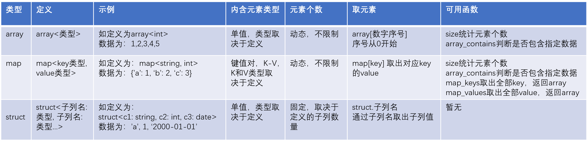


## 数据查询

### 基本查询

Hive中使用基本查询 SELECT、WHERE、GROUP BY、聚合函数、HAVING、JOIN 和普通的SQL语句没有区别

```sql
SELECT [ALL | DISTINCT] select_expr, select_expr, ...
FROM table_reference
[WHERE where_condition]
[GROUP BY col_list]
[HAVING having_condition]
[ORDER BY col_list]
[CLUSTER BY col_list
  | [DISTRIBUTE BY col_list] [SORT BY col_list]
]
[LIMIT number]

```


### RLIKE 正则匹配

1. 什么是正则表达式
正则表达式就是一种规则的集合。通过特定的规则字符来匹配字符串是否满足规则的描述。
2. RLIKE的作用
可以基于正则表达式，对数据内容进行匹配


### UNION 联合查询

UNION 用于将多个 SELECT 语句的结果组合成单个结果集。

每个 select 语句返回的列的数量和名称必须相同。否则，将引发架构错误。

自带去重效果，如果无需去重，需要使用 UNION ALL

UNION 可以用在任何需要SELECT发挥的地方（包括子查询、ISNERT SELECT等）

```sql
-- 基础语法
SELECT ...
  UNION [ALL]
SELECT ...
```


### TABLESAMPLE 数据抽样

进行随机抽样，本质上就是用TABLESAMPLE函数

```sql
-- 语法1，基于随机分桶抽样
SELECT ... FROM tbl TABLESAMPLE(BUCKET x OUT OF y ON(colname | rand()))
-- y表示将表数据随机划分成y份（y个桶）
-- x表示从y里面随机抽取x份数据作为取样
-- colname表示随机的依据基于某个列的值
-- rand()表示随机的依据基于整行

-- 示例：
SELECT username, orderId, totalmoney FROM itheima.orders TABLESAMPLE(BUCKET 1 OUT OF 10 ON username);

SELECT * FROM itheima.orders TABLESAMPLE(BUCKET 1 OUT OF 10 ON rand());

-- 注意：
-- 使用colname作为随机依据，则其它条件不变下，每次抽样结果一致
-- 使用rand()作为随机依据，每次抽样结果都不同


-- 语法2，基于数据块抽样
SELECT ... FROM tbl TABLESAMPLE(num ROWS | num PERCENT | num(K|M|G));
-- num ROWS 表示抽样num条数据
-- num PERCENT 表示抽样num百分百比例的数据
-- num(K|M|G) 表示抽取num大小的数据，单位可以是K、M、G表示KB、MB、GB

-- 注意：
-- 使用这种语法抽样，条件不变的话，每一次抽样的结果都一致
-- 即无法做到随机，只是按照数据顺序从前向后取。

```

1. 为什么需要抽样？
大数据体系下，表内容一般偏大，小操作也要很久
所以如果想要简单看看数据，可以通过抽样快速查看
2. TABLESAMPLE函数的使用
桶抽样方式，TABLESAMPLE(BUCKET x OUT OF y ON(colname | rand()))，推荐，完全随机，速度略慢块抽样，使用分桶表可以加速
块抽样方式，TABLESAMPLE(num ROWS | num PERCENT | num(K|M|G))，速度快于桶抽样方式，但不随机，只是按照数据顺序从前向后取。


### Virtual Columns 虚拟列

```sql
SELECT *, INPUT__FILE__NAME, BLOCK__OFFSET__INSIDE__FILE, ROW__OFFSET__INSIDE__BLOCK FROM itheima.course;

SELECT *, BLOCK__OFFSET__INSIDE__FILE FROM course WHERE BLOCK__OFFSET__INSIDE__FILE > 50;

-- 统计分桶表每个桶的数据行数
SELECT INPUT__FILE__NAME, COUNT(*) FROM itheima.orders_bucket GROUP BY INPUT__FILE__NAME;


```

1. 什么是虚拟列，有哪些虚拟列？
虚拟列是Hive内置的可以在查询语句中使用的特殊标记，可以查询数据本身的详细参数。
`INPUT__FILE__NAME`，显示数据行所在的具体文件
`BLOCK__OFFSET__INSIDE__FILE`，显示数据行所在文件的偏移量
`ROW__OFFSET__INSIDE__BLOCK`，显示数据所在HDFS块的偏移量
	此虚拟列需要设置：SET hive.exec.rowoffset=true 才可使用
2. 虚拟列的作用
查看行级别的数据详细参数
可以用于WHERE、GROUP BY等各类统计计算中
可以协助进行错误排查工作


 

## 函数

### Hive函数的分类

Hive的函数分为两大类：内置函数（Built-in Functions）、用户定义函数UDF（User-Defined Functions）

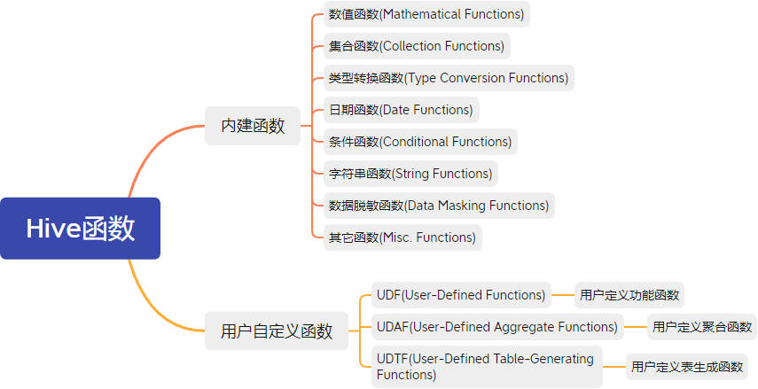

**查看函数列表**

```sql
-- 查看当下可用的所有函数
show functions
-- 来查看函数的使用方式
describe function extended funcname

```


### 数值、集合、类型转换、日期函数

**Mathematical Functions 数学函数 - 部分**

```sql
-- 取整函数: round  返回double类型的整数值部分 （遵循四舍五入）
select round(3.1415926);
-- 指定精度取整函数: round(double a, int d) 返回指定精度d的double类型
select round(3.1415926,4);
-- 取随机数函数: rand 每次执行都不一样 返回一个0到1范围内的随机数
select rand();
-- 指定种子取随机数函数: rand(int seed) 得到一个稳定的随机数序列
select rand(3);
-- 求数字的绝对值
select abs(-3);
-- 得到pi值（小数点后15位精度）
select pi();

```

**Collection Functions 集合函数 - 全部**

| Return Type | Name(Signature)                  | Description                                            |
| :---------- | -------------------------------- | ------------------------------------------------------ |
| int         | size(Map<K.V>)                   | 返回map类型的元素个数                                  |
| int         | size(Array<T>)                   | 返回array类型的元素个数                                |
| array<K>    | map_keys(Map<K.V>)               | 返回map内的全部key（得到的是array）                    |
| array<V>    | map_values(Map<K.V>)             | 返回map内的全部value（得到的是array）                  |
| boolean     | array_contains(Array<T>,  value) | 如果array包含指定value，返回True                       |
| array<T>    | sort_array(Array<T>)             | 根据数组元素的自然顺序按升序对输入数组进行排序并返回它 |

**Type Conversion Functions 类型转换函数 - 全部**

| Return Type                    | Name(Signature)        | Description                                                  |
| ------------------------------ | ---------------------- | ------------------------------------------------------------ |
| binary                         | binary(string\|binary) | 将给定字符串转换为二进制                                     |
| Expected "=" to follow  "type" | cast(expr as <type>)   | 将表达式 expr 的结果转换为给定类型 。  例如，cast('1' as BIGINT） 会将字符串 '1' 转换为整数表示。如果转换不成功，则返回 null。  对于cast(expr as boolean)，对于非空字符串将会返回True |

**Date Functions 日期函数 - 部分**

| Return Type                                   | Name(Signature)                                              | Description                                                  |
| --------------------------------------------- | ------------------------------------------------------------ | ------------------------------------------------------------ |
| timestamp                                     | current_timestamp()                                          | 返回当前时间戳。在同一个查询中对  current _ time戳的所有调用都返回相同的值。 |
| date                                          | current_date()                                               | 返回当前日期。在同一个查询中对current_date  戳的所有调用都返回相同的值。 |
| 2.1.0版本之前返回string      现在版本返回date | to_date(string  timestamp)                                   | 时间戳转日期                                                 |
| int                                           | year(string  date)<br/>quarter(date/timestamp/string)<br/>month(string  date)<br/>day(string  date)<br/>dayofmonth(date)<br/>hour(string  date)<br/>minute(string  date)<br/>second(string  date)<br/>weekofyear(string  date) | 得到给定时间的：年<br/>得到给定时间的：季度<br/>得到给定时间的：月<br/>得到给定时间的：日<br/>得到给定时间的：当前月份第几天  <br/>得到给定时间的：小时<br/>得到给定时间的：分钟<br/>得到给定时间的：秒<br/>得到给定时间的：本年第几周 |
| int                                           | datediff(string  enddate, string startdate)                  | 返回enddate 到 startdate之间的天数                           |
| 2.1.0版本之前返回string      现在版本返回date | date_add(date/timestamp/string  startdate, tinyint/smallint/int days)  date_sub(date/timestamp/string  startdate, tinyint/smallint/int days) | 日期相加:  date_add('2008-12-31', 1) = '2009-01-01’.    <br/>日期相减:  date_sub('2008-12-31', 1) = '2008-12-30'. |


### 条件、字符串、脱敏、其它函数

**Conditional Functions 条件函数 - 全部**

| Return Type | Name(Signature)                                             | Description                                                  |
| ----------- | ----------------------------------------------------------- | ------------------------------------------------------------ |
| T           | if(boolean testCondition, T valueTrue,  T valueFalseOrNull) | 如果 testCondition 为 true，则返回 valueTrue，否则返回 valueFalseOrNull。 |
| boolean     | isnull( a )                                                 | 如果 a 为 NULL，则返回 true，否则返回 false。                |
| boolean     | isnotnull ( a )                                             | 如果 a 不为 NULL，则返回 true，否则返回 false。              |
| T           | nvl(T value, T default_value)                               | 如果value为 null，则返回default_value，否则value。           |
| T           | COALESCE(T v1, T v2, ...)                                   | 返回第一个不是 NULL 的 v，如果所有 v 都是 NULL，则返回  NULL。 |
| T           | CASE a WHEN b THEN c [WHEN d THEN e]*  [ELSE f] END         | 当 a = b 时，返回 c; [当 a = d 时，返回 e]* ;否则返回 f。    |
| T           | CASE WHEN a THEN b [WHEN c THEN d]*  [ELSE e] END           | When a = true, returns b; when c =  true, returns d; else returns e.  a可以是表达式，如1=1 |
| T           | nullif( a, b )                                              | 如果 a=b，则返回 NULL;否则返回a 。  等价：CASE WHEN a = b then NULL else a |
| void        | assert_true(boolean condition)                              | 如果boolean_condition结果不为True，则引发异常报错  比如：select assert_true (2<1). |

**String Functions 字符串函数 - 部分**

| Return Type | Name(Signature)                                | Description                                                  |
| ----------- | ---------------------------------------------- | ------------------------------------------------------------ |
| string      | concat(string\|binary  A, string\|binary B...) | 连接字符串  For example, concat('foo', 'bar')  results in 'foobar' |
| string      | concat_ws(string  SEP, string A, string B...)  | 同concat，但是可以自己定义字符串之间的分隔符（SEP）          |
| int         | length(string  A)                              | 字符串长度                                                   |
| string      | lower(string  A)<br/>upper(string  a)          | 全部转小写<br/>全部转大写                                    |
| string      | trim(string  A)                                | 返回从  A 的两端裁剪空格得到的字符串。例如，trim(‘   foobar   ’)的结果是‘ foobar’ |
| array       | split(string  str, string pat)                 | 按照pat分隔字符串，pat是正则表达式                           |

**Data Masking Functions 数据脱敏函数 - 部分**

| Return Type | Name(Signature)                      | Description                                     |
| ----------- | ------------------------------------ | ----------------------------------------------- |
| string      | mask_hash(string\|char\|varchar str) | 对字符串进行hash加密<br/>非字符串加密会得到NULL |

**Misc. Functions 其它函数 - 部分**

| Return Type | Name(Signature)    | Description          |
| ----------- | :----------------- | -------------------- |
| int         | hash(a1[, a2...])) | 返回参数的hash数字   |
| string      | current_user()     | 返回当前登录用户     |
| string      | current_database() | 返回当前选择的数据库 |
| string      | version()          | 返回当前hive版本     |
| string      | md5(string/binary) | 返回给定参数的md5值  |


## 案例

### 需求分析


### ETL数据清洗


### 指标计算


### 可视化展现