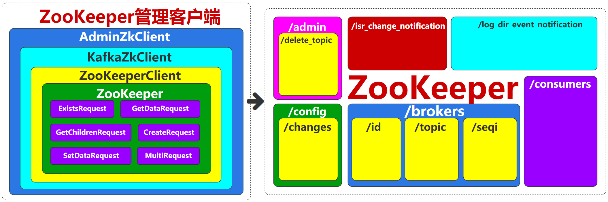
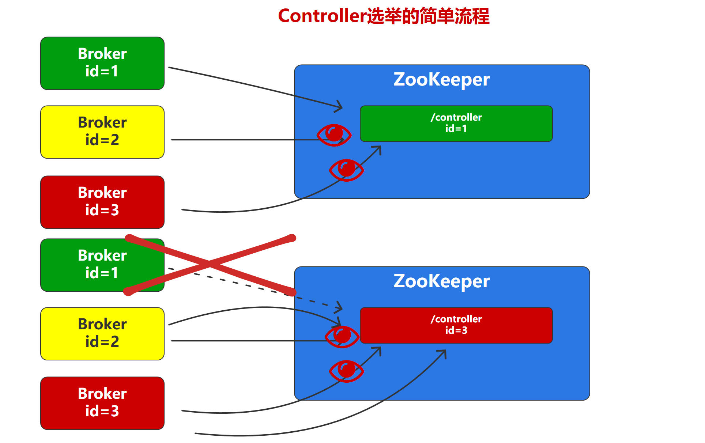

# 架构

横向扩展：增加服务节点，搭建服务器集群，降低单点故障所带来的风险。

纵向扩展：增加系统的资源配置，比如，使用IO效率更好的固态硬盘、更大的内存、更多的CPU核、更快的网络。

**当前的IO热点问题，需要横向的对Broker节点进行扩展**

- 为了数据可靠性，可以将数据文件进行备份，但是Kafka没有备份的概念
  - Kafka中称之为副本，多个副本同时只能有一个提供数据的读写操作，其他副本只是用于备份
    - 具有读写能力的副本称之为Leader副本，作为备份的副本称之为Follower副本

Broker：服务节点（集群）

Partition：分区（编号，从0开始）把一个Topic切分成多块

副本：Leader和Follower

**给管理者增加备份**

**核心组件**

Kafka 作为独立的分布式消息传输系统，还需要第三方软件ZooKeeper进行节点之间的协调调度，不能实现自我的管理，导致Kafka和其他软件之间形成耦合，制约了Kafka的发展，甚至会成为Kafka性能的瓶颈。从Kafka2.8开始增加特定的算法来实现节点之间的协调管理，在Kafka4版本中完全移除ZooKeeper

# 启动服务

## ZooKeeper的核心功能

Kafka 利用这些功能进行集群管理

## Broker启动后ZooKeeper节点的变化

​                Broker的一个组件                                                                     ZooKeeper服务器中的节点

## Controller的选举

## Controller和Broker的通信原理和底层通信机制

## Broker组件对象（源码）

`KafkaServer.scala`

# 创建主题

## 主题分区副本分配策略

一个主题

三个主题

## 底层流程

# 生产数据

## 生产者流程分析

## 拦截器和序列化处理

## 分区器及分区计算策略

分区编号计算：粘性分区策略

## 数据收集器和Sender发送线程

## 数据的异步发送和同步发送

## ACKS数据接收应答处理机制

## 数据重复及乱序的原因及原理

重试

重复

乱序

## 幂等性操作

> Kafka为了解决数据的重复和乱序问题，提供了幂等性操作。

幂等性操作的要求

1. ACKS = -1（默认是-1）
2. 开启重试机制
3. 在途请求缓冲区的数量不能大于5（默认是5）

## 事务操作

> 生产者ID发生变化（生产者跨会话）导致幂等性失效，通过事务解决

# 存储数据

## 数据存储流程

## 数据文件内容及数据定位

index文件称之为稀疏索引

## 数据文件字节计算方式

## 数据同步一致性问题

**副本同步时的水位线变化**

**ISR列表变化和传播**

# 消费数据

## 分区分配策略

## 流程

# 扩展

## 分布式集群脑裂问题

## 零拷贝

