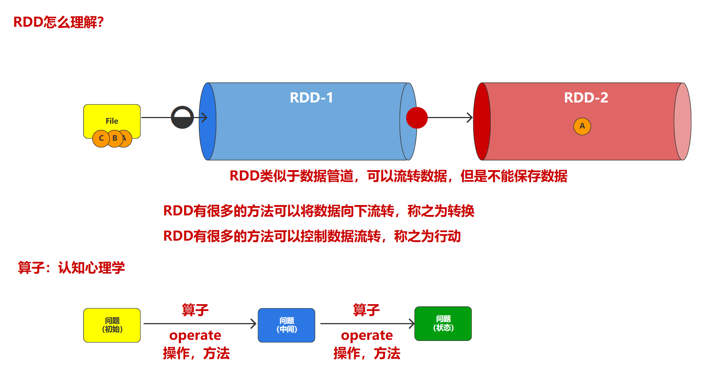
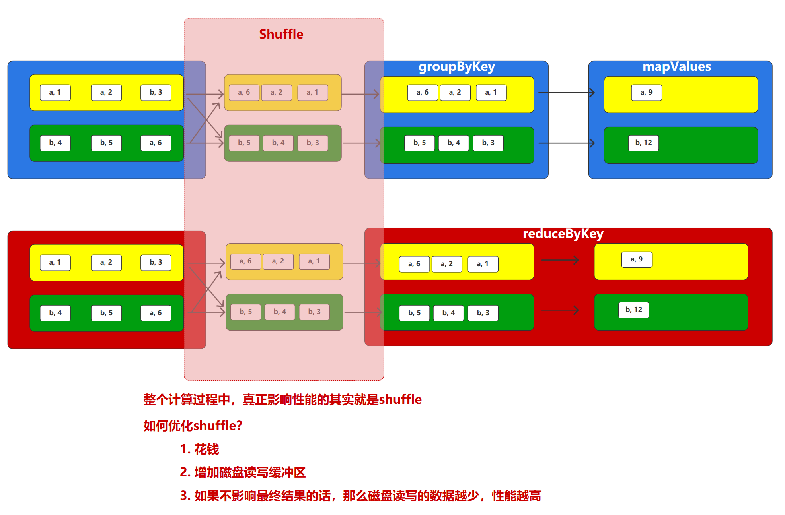
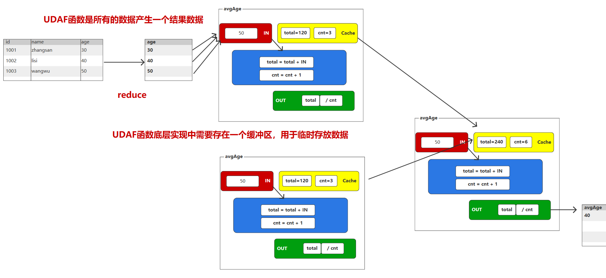

# Spark入门

## Spark概述

### 什么是Spark

Hadoop主要解决，海量数据的存储和海量数据的分析计算。

Spark是一种基于内存的快速、通用、可扩展的大数据分析计算引擎。

### Spark内置模块


## Spark运行模式

### Spark安装地址

1）官网地址：http://spark.apache.org/

2）文档查看地址：https://spark.apache.org/docs/3.3.1/

3）下载地址：https://spark.apache.org/downloads.html

​						 https://archive.apache.org/dist/spark/

### Local模式

Local模式：在本地部署单个Spark服务


### YARN模式

YARN模式：Spark使用Hadoop的YARN组件进行资源与任务调度


# SparkCore

## RDD概述

### 什么是RDD

RDD（Resilient Distributed Dataset）叫做弹性分布式数据集，是Spark中最基本的数据抽象。

代码中是一个抽象类，它代表一个弹性的、不可变、可分区、里面的元素可并行计算的集合。

### RDD五大特性


## RDD编程

### RDD的创建

#### 从集合中创建


#### 从外部存储系统的数据集创建


#### 从其他RDD创建


### 分区规则

#### 从集合创建RDD


#### 从文件创建RDD


### RDD的方法

- RDD的方法会有很多，主要讲解核心，重要的方法
  - 学习的重点：名字、IN、OUT

- RDD的方法会有很多，但是分为2类

  1. 转换：将数据向后流转

  2. 行动：打开数据开关

- RDD方法处理数据的分类

  1. 单值 : 1, "abc", new User(), new ArrayList(), (Key, Value)

  2. 键值 : KV => (Key, Value)




### Transformation转换算子


#### map()映射


#### filter()过滤

RDD的转换方法：filter(过滤)

RDD可以根据指定的过滤规则对数据源中的数据进行筛选过滤
如果满足规则（返回结果true），那么数据保留；如果不满足规则（返回结果false），那么数据就会丢弃

filter方法在执行过程中可能会出现数据倾斜的情况，需要慎重考虑

```java
public class Spark14_Operate_Transform_Partition {
    public static void main(String[] args) {

        final SparkConf conf = new SparkConf();
        conf.setMaster("local");
        conf.setAppName("spark");

        final JavaSparkContext jsc = new JavaSparkContext(conf);

        final List<Integer> nums = Arrays.asList(1, 3, 5, 2, 4, 6);
        // 【1，3，5】【2，4，6】
        final JavaRDD<Integer> rdd = jsc.parallelize(nums, 2);
        // 【】【2，4，6】
        final JavaRDD<Integer> filterRDD = rdd.filter(num -> num % 2 == 0);

        // TODO 改变分区。
        //      合并分区：缩减分区
        //      coalesce方法默认没有shuffle功能，所以数据不会被打乱重新组合，所以如果要扩大分区是无法实现的。
        //      coalesce方法可以设定第二个shuffle参数，如果设定shuffle功能为true，那么可以扩大分区。
//        final JavaRDD<Integer> coalesceRDD = filterRDD.coalesce(3, true);
//        coalesceRDD.saveAsTextFile("output");

        // TODO 重分区。
        //      repartition方法其实就是设定shuffle为true的coalesce方法
        filterRDD.repartition(3).saveAsTextFile("output");

        // 缩减分区：coalesce
        // 扩大分区：repartition

        jsc.close();
    }
}
```

#### flatMap()扁平化


#### groupBy()分组


#### distinct()去重

hashSet 去重，是单点去重

distinct 是分布式去重，采用了 分组+shuffle 的处理方式

#### sortBy()排序

```java
// TODO sortBy方法：按照指定的排序规则对数据进行排序
//      sortBy方法可以传递三个参数
//           第一个参数表示排序规则:
//                Spark会为每一个数据增加一个标记，然后按照标记对数据进行排序
//           第二个参数表示排序的方式：升序（true），降序(false)
//           第三个参数表示分区数量
```

#### mapValues()只对V进行操作


#### groupByKey()按照K对V分组


#### reduceByKey()按照K对V聚合


#### reduceByKey和groupByKey区别




#### sortByKey()按照K排序


### Action行动算子

- 行动算子和转换算子如何区分？

  - 转换算子的返回值是RDD 
    - 转换算子的目的：将旧的RDD转换成新的RDD，为了组合多个RDD的功能
    - RDD(In) -> RDD(Out)

  - 行动算子的返回值是具体的结果

#### collect()以数组的形式返回数据集

collect用于采集数据


#### count()返回RDD中元素个数

count 获取结果数量

#### first()返回RDD中的第一个元素

first 获取结果的第一个

#### take()返回由RDD前n个元素组成的数组

take 从结果中获取前N个

#### countByKey()统计每种key的个数

countByKey 将结果按照Key计算数量

#### save相关算子

saveAsTextFile(path) 保存成Text文件

saveAsObjectFile(path) 序列化成对象保存到文件

#### foreach()遍历RDD中每一个元素

foreach算子是分布式循环：分区内有序，分区间无序

foreach 执行效率低，但是占内存比较小。


#### foreachPartition ()遍历RDD中每一个分区

foreachPartition 执行效率高，但是依托于内存大小。


### RDD序列化

Kryo序列化框架


### RDD依赖关系

#### 依赖关系和血缘关系


#### 窄依赖


#### 宽依赖


#### 作业、阶段、任务的关系


#### 分区的数量

任务（分区）的数量应该设定为多少?

简单可以理解为就是资源核数，一般推荐分区数量为资源核数的2~3倍。


### RDD持久化

持久化：将对象长时间的保存

序列化：内存中的对象 ==> 字节序列（byte数组）

#### Cache缓存

```java
// 数据缓存
// cache底层调用的就是persist方法,缓存级别默认用的是MEMORY_ONLY
rdd.cache()
// persist方法可以更改存储级别
rdd.persist(StorageLevel.MEMORY_AND_DISK_2)
```


#### CheckPoint检查点

```java
// 检查点操作目的是希望RDD结果长时间的保存，所以需要保证数据的安全，会从头再跑一遍，性能比较低
// 为了提高效率，Spark推荐在检查点之前，执行cache方法，将数据缓存。
rdd.cache();
rdd.checkpoint();
```


#### 缓存和检查点区别

cache方法会在血缘关系中增加依赖关系

checkpoint方法会切断（改变）血缘关系

#### shuffle算子的持久化

所有的shuffle操作性能是非常低的，所以Spark为了提升shuffle算子的性能，每个shuffle算子都是自动含有缓存。

如果重复调用相同规则的shuffle算子，那么第二次shuffle算子不会有shuffle操作。


### 键值对RDD数据分区

Spark目前支持Hash分区、Range分区、用户自定义分区


## 广播变量


## SparkCore实战

### 开发原则

大数据开发：数据量大

1. 多什么，删什么（减小数据规模）
   去除搜索数据；多余的数据字段

2. 缺什么，补什么
   品类；行为类型

3. 功能实现中，要尽可能少地使用 shuffle 操作。shuffle 越多，性能越低。

### 数据格式：JSON

JSON = JavaScript Object Notation

JSON 对象 = [{"属性名":"属性值", "属性名":1002}, {"属性名":"属性值", "属性名":1003}]

1. 每一行就是一个JSON格式的数据，而且表示一个对象，对象内容必须包含在 {} 中
2. 对象中的多个属性必须采用逗号隔开
3. 每一个属性，属性名和属性值之间采用冒号隔开
4. 属性名必须采用双引号声明，属性值如果为字符串类型，也需要采用双引号包含


# SparkSQL

## SparkSQL概述

RDD功能和方法是重点。

数据源的数据，格式不是我们的学习重点。所以解析数据非常的繁琐。

所在在特殊的场景中，Spark对数据处理的逻辑进行了封装，简化开发。

SparkSQL其实就是对Spark RDD的封装。


SQL(源码) => Hive(javac.exe) => MR(class) => jar => run => JVM => Process => main

Hive => 可以提高开发效率


MR运行慢 => Spark

MR开发慢 => Hive => 解析SQL


Spark + Hive => Shark => Spark On Hive => SparkSQL => Spark parse SQL => RDD

​                                        => Hive On Spark => 数据仓库 => Hive parse SQL => RDD							   


## SparkSQL编程

### 环境对象的封装


### 模型对象的封装


### 访问数据模型（SQL方式）


### UDF


```java
package com.atguigu.bigdata.sparksql;

import org.apache.spark.sql.Dataset;
import org.apache.spark.sql.Row;
import org.apache.spark.sql.SparkSession;
import org.apache.spark.sql.api.java.UDF1;

import org.apache.spark.sql.types.DataTypes;
import org.apache.spark.sql.types.StringType$;

import static org.apache.spark.sql.types.DataTypes.StringType;

public class SparkSQL03_SQL_UDF {
    public static void main(String[] args) {

        // TODO 构建环境对象
        //      Spark在结构化数据的处理场景中对核心功能，环境进行了封装
        //      构建SparkSQL的环境对象时，一般采用构建器模式
        //      构建器模式： 构建对象
        final SparkSession sparkSession = SparkSession
                .builder()
                .master("local[*]")
                .appName("SparkSQL")
                .getOrCreate();


        final Dataset<Row> ds = sparkSession.read().json("data/user.json");
        ds.createOrReplaceTempView("user");

        
        // TODO SparkSQL提供了一种特殊的方式，可以在SQL中增加自定义方法来实现复杂的逻辑

        // TODO 如果想要自定义的方法能够在SQL中使用，那么必须在SPark中进行声明和注册
        //      register方法需要传递3个参数
        //           第一个参数表示SQL中使用的方法名
        //           第二个参数表示逻辑 : IN => OUT
        //           第三个参数表示返回的数据类型 : DataType类型数据，需要使用scala语法操作，需要特殊的使用方式。
        //                 scala Object => Java
        //                 StringType$.MODULE$ => case object StringType
        //                 DataTypes.StringType
        sparkSession.udf().register("prefixName", new UDF1<String, String>() {
            @Override
            public String call(String name) throws Exception {
                return "Name:" + name;
            }
        }, StringType);

        String sql = "select prefixName(name) from user";
        final Dataset<Row> sqlDS = sparkSession.sql(sql);
        sqlDS.show();


        // TODO 释放资源
        sparkSession.close();

    }
}

```


### UDAF




```java
package com.atguigu.bigdata.sparksql;

import org.apache.spark.sql.*;
import static org.apache.spark.sql.functions.*;


public class SparkSQL03_SQL_UDAF {
    public static void main(String[] args) {

        final SparkSession sparkSession = SparkSession
                .builder()
                .master("local[*]")
                .appName("SparkSQL")
                .getOrCreate();


        final Dataset<Row> ds = sparkSession.read().json("data/user.json");
        ds.createOrReplaceTempView("user");

        // TODO SparkSQL采用特殊的方式将UDAF转换成UDF使用
        //      UDAF使用时需要创建自定义聚合对象
        //        udaf方法需要传递2个参数
        //             第一个参数表示UDAF对象
        //             第二个参数表示输入数据的编码
        sparkSession.udf().register("avgAge", udaf(
                new MyAvgAgeUDAF(), Encoders.LONG()
        ));

        String sql = "select avgAge(age) from user";
        final Dataset<Row> sqlDS = sparkSession.sql(sql);
        sqlDS.show();


        // TODO 释放资源
        sparkSession.close();

    }
}

```


```java
package com.atguigu.bigdata.sparksql;

import org.apache.spark.sql.Encoder;
import org.apache.spark.sql.Encoders;
import org.apache.spark.sql.expressions.Aggregator;


// TODO 自定义UDAF函数，实现年龄的平均值
//      1. 创建自定义的【公共】类
//      2. 继承 org.apache.spark.sql.expressions.Aggregator
//      3. 设定泛型
//          IN : 输入数据类型
//          BUFF : 缓冲区的数据类型
//          OUT : 输出数据类型
//     4. 重写方法 （ 4（计算） + 2(状态)）
public class MyAvgAgeUDAF extends Aggregator<Long, AvgAgeBuffer, Long> {
    @Override
    // TODO 缓冲区的初始化操作
    public AvgAgeBuffer zero() {
        return new AvgAgeBuffer(0L, 0L);
    }

    @Override
    // TODO 将输入的年龄和缓冲区的数据进行聚合操作
    public AvgAgeBuffer reduce(AvgAgeBuffer buffer, Long in) {
        buffer.setTotal(buffer.getTotal() + in);
        buffer.setCnt(buffer.getCnt() + 1);
        return buffer;
    }

    @Override
    // TODO 合并缓冲区的数据
    public AvgAgeBuffer merge(AvgAgeBuffer b1, AvgAgeBuffer b2) {
        b1.setTotal(b1.getTotal() + b2.getTotal());
        b1.setCnt(b1.getCnt() + b2.getCnt());
        return b1;
    }

    @Override
    // TODO 计算最终结果
    public Long finish(AvgAgeBuffer buffer) {
        return buffer.getTotal() / buffer.getCnt();
    }

    @Override
    public Encoder<AvgAgeBuffer> bufferEncoder() {
        return Encoders.bean(AvgAgeBuffer.class);
    }

    @Override
    public Encoder<Long> outputEncoder() {
        return Encoders.LONG();
    }
}
```


```java
package com.atguigu.bigdata.sparksql;

import java.io.Serializable;

public class AvgAgeBuffer implements Serializable {
    private Long total;
    private Long cnt;

    public AvgAgeBuffer(Long total, Long cnt) {
        this.total = total;
        this.cnt = cnt;
    }

    public AvgAgeBuffer() {
    }

    public Long getTotal() {
        return total;
    }

    public void setTotal(Long total) {
        this.total = total;
    }

    public Long getCnt() {
        return cnt;
    }

    public void setCnt(Long cnt) {
        this.cnt = cnt;
    }
}
```


## SparkSQL数据的加载与保存

CSV

JSON

Parquet

JDBC

Hive


## SparkSQL项目实战

SparkSQL read json文件，如果文件中的数据为整型数据，一般都会封装为BigInt类型（Long）


**需求实现-代码**

`SparkSQL09_Source_Req_3.java`

`MyCityRemarkUDAF.java`

`MyCityRemarkBuffer.java`

`CityCount.java`


# SparkStreaming

## 原理


## 转换操作

Spark Core : RDD的方法称之为算子

Spark Streaming: DStream的方法称之为原语


## 输出操作


## 窗口操作


# Spark内核及调优

## 运行流程


## 核心对象


## Task任务的调度执行


## Shuffle底层的实现原理


## 内存管理


