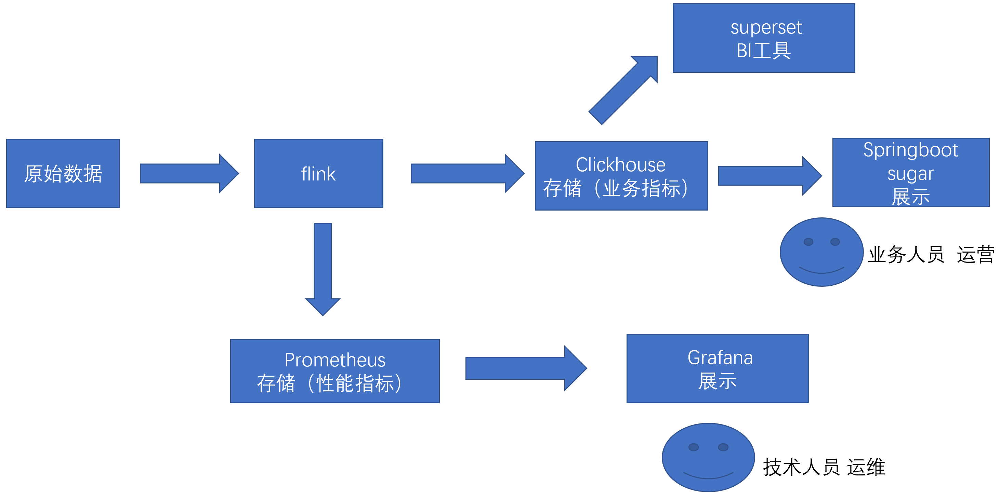
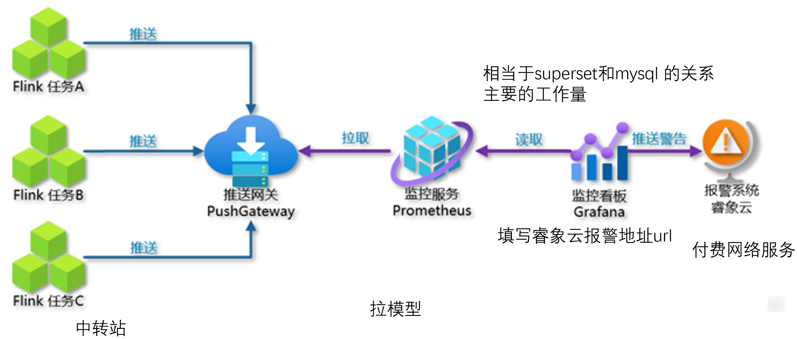
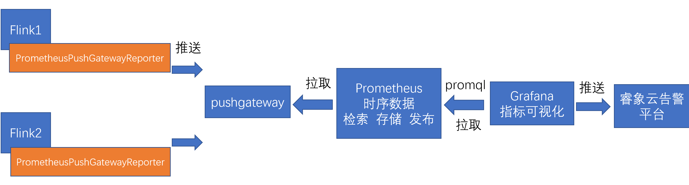
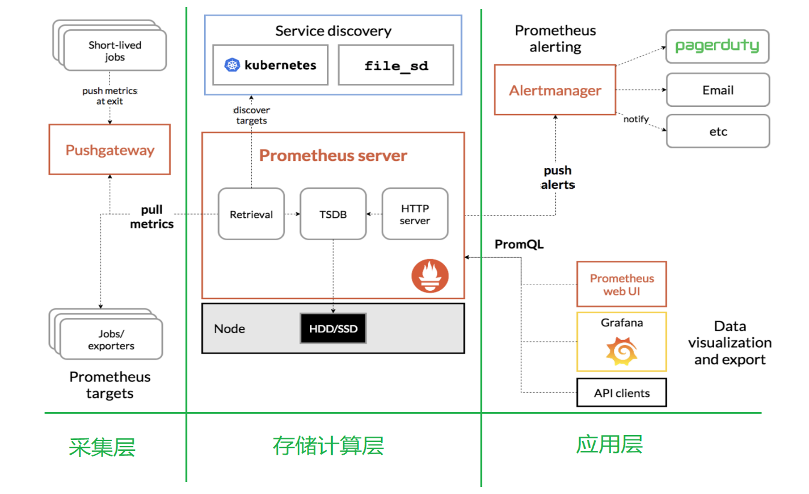
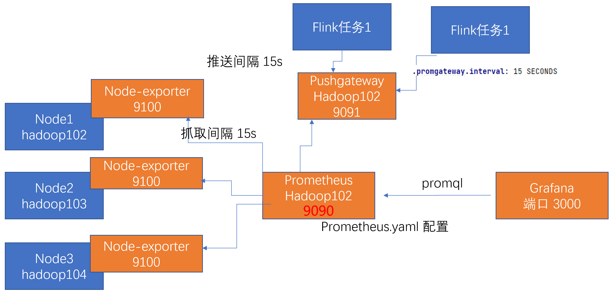
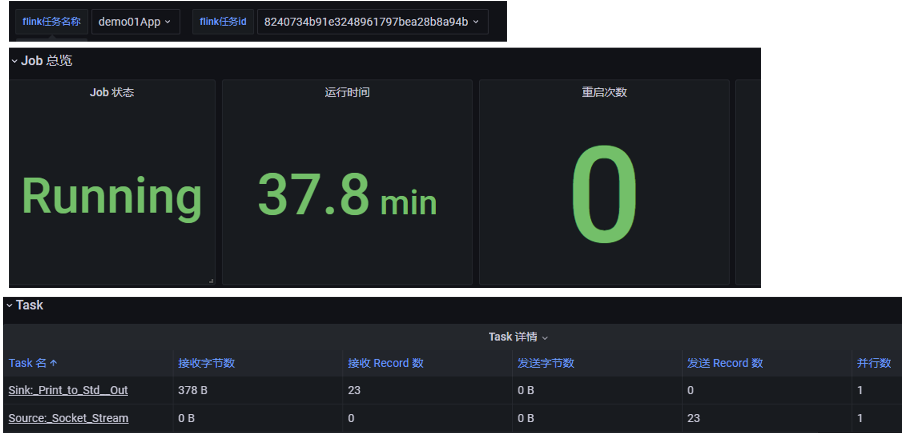
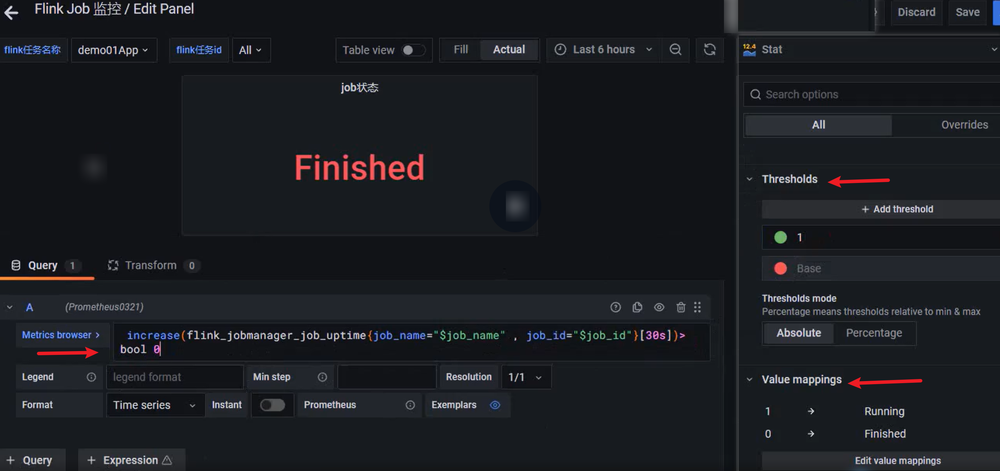
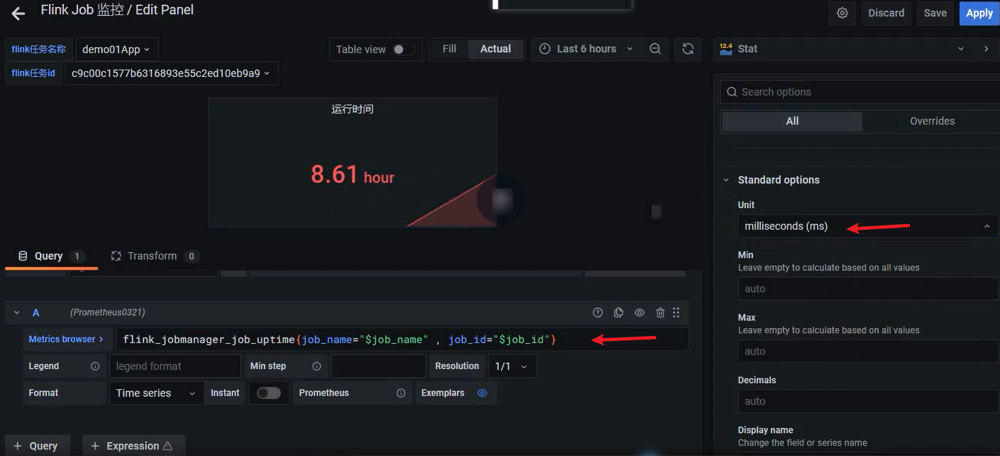
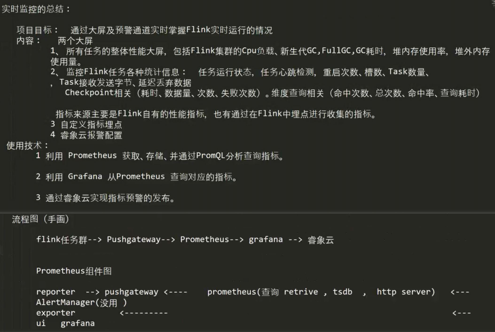
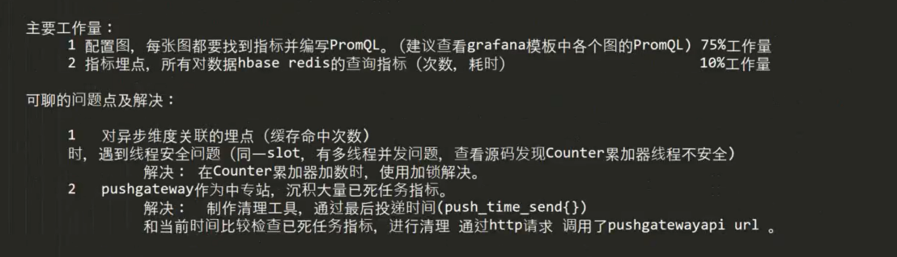

# 项目介绍




# 监控架构

容器和计算引擎之间的关系：推模型 or 拉模型

Flink 和 Doris：推

Flink 和 Kafka：拉




由于 flink 各个任务运行的位置节点、进程都是由 yarn 调配，没有确定的位置，所以 prometheus 没有办法主动拉取，只能由 flink 程序主动地将性能指标推送到 pushgateway 上，再由 prometheus 拉取





# Prometheus 架构







# 关于job的各种名称

1  yarn名称   flink run   ynm    yarn控制台里显示的名称 和指标没关系 

2  指标的 job名称   以进程为单位   

​	 jobmanager taskmanager  1~多个		pushgateway.jobname+ 随机值       

3  flink的 job名称    env.execute(“xxx”)     以job为单位 

​	 1jm +2tm  job名称是一样的   同样一个任务多次启动名称一样

 4  Flink 的 job_id     以job为单位 

​	  flink产生的随机值  每次启动会产生新的id


# job 监控

## 以job为单位的监控大屏




## 筛选菜单

如何通过条件筛选job

```sql
label_values(flink_jobmanager_job_uptime,job_name)
label_values(flink_jobmanager_job_uptime{job_name="$job_name"},job_id)
```


## job 状态




## 运行时间




## 表格指标


# 自定义指标

> 自定义指标： 维度查询 缓存命中率

- 1  分析指标：   缓存命中次数    /   总维度查询次数

  - 定义指标    

  ​       flink_xxx_custom_cache_dim_user_hit_count  缓存命中次数 

  ​       flink_xxx_custom_cache_dim_user_total_count   总维度查询次数

- 2   埋点

  - 1 在程序中 写埋点的代码 ，进行计数统计。

  - 2  把计数结果包装为 flink指标

    - 利用flink-metric-prometheus包中的Metrics对象实现累计完成的。

      注意点：异步io多线程的场景，而Counter是每个并行度只有一个。多线程场景下，Counter有线程安全问题，所以通过加锁解决。

- 3  写promsql查询指标

  - 统计本个时间周期的最大值 减去 上个时间周期的最大值  =  本个时间周期的增量 

    再根据维度进行聚合 (   job_name,job_id,task_name)

- 4   把查询结果，形成grafana的图表展示出来。
  - 1  添加1个panel   
  - 2  选型  table   
  - 3  填 promql      
    - 3个指标，每个指标一个promql，指标类型改成table类型 
  - 4  表格的transform，展示格式   
    - 4.1  merge 
    - 4.2  选择维度列和指标列    group by 
    - 4.3  定义表头  organize field
  - 5  选择数值单位  右侧overrides 选择字段  unit ->percent      


# 睿象云

1 注册账号

2 选择集成的框架  (框架，获得接口地址url)

3 配置分派策略  （人)

4 配置通知策略   ( 终端)


## 配置告警规则：任务终止

- 1  任务之前是正常   increase(flink_jobmanager_job_uptime[60s] offset 60s)  大概在60000左右浮动

- 2  最近出现了停止   increase(flink_jobmanager_job_uptime[60s] )   

  ​    如果正常 60000上下 如果 异常了 会变为0

- 两值相减 正常一直保持为0   如果程序停止 会出现60000-0 =60000的情况  需要告警 


# pushgateway 自动检查 自动清理

> 制作一个pushgateway 自动检查 自动清理的工具 

- 问题：pushgateway 功能简易，旧的历史数据会沉积于此，只能手动检查手动清理 。

- 如何清理  
  - 调用pushgateway的http接口服务    DELETE [http://](http://hostname:port/metrics/job/{job})[hostname:port](http://hostname:port/metrics/job/{job})[/metrics/job/{job}](http://hostname:port/metrics/job/{job})

- 删哪个job
  - 利用 push_time_seconds获得程序最后一次推送的时间戳，和当前时间进行对比，如果超过一个阈值（10分钟） 则认定为待清理job
  - push_time_seconds{instance="",job="prome_dim_join_app031288df2b3dd3f262c5a5bbb5a099c7"} 1.663897303242992e+09 

- 任务性质：周期性执行的批处理


# 总结






