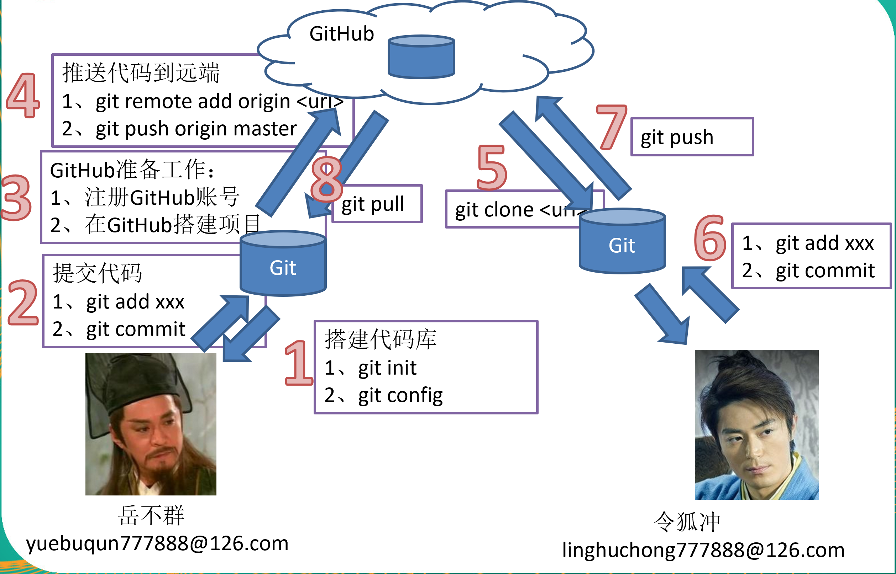

# 基本操作

```shell
# 1 初始化本地库 
git init

# 2 配置签名
git config user.name "name"
git config user.email "email"
# 全局加 --global
git config --global user.name "name"  

# 3 进入暂存区 
git add 文件名

# 4 查看状态
git status

# 5 提交本地库 
git commit -m "提交备注"

# 6 查看提交记录
git log
# 日志每条一行显示方式
git log --pretty=oneline  

# 7 版本回退
git reset --hard HEAD^   # 回退之前一个版本
git reset --hard HEAD~n  # 回退n次
git reset --hard 7位版本号  # 穿梭到指定版本号的位置

# 8 查看所有历史操作
git reflog

# 9 还原文件（其实是从暂存区还原）
# 如果对文件进行修改后，想还原为最后一次提交的版本
git checkout -- 文件名  

# 10 删除文件
# 删除目录下某个已经被追踪的文件，然后使用 git status 查看状态
# 向暂存区提交删除操作
git add 文件名
# 提交版本库
git commit -m "提交备注"

```


# 分支

```shell
# 1 查看分支
git branch –v 

# 2 创建分支
git branch 分支名    

# 3 切换分支
git checkout 分支名  

# 4 合并分支（站在旧分支 合并 新分支）
git merge 分支名     

# 5 删除分支
git branch -d 分支名 

# 6 分支冲突
# 去出现冲突的文件中，仔细阅读冲突的代码，删除分隔符，合并 或者 选择要保留的代码 
git add 
git commit 

```


# 代码托管平台

```shell
# 0 创建本地项目 d:/…/yuebuqun_jianfa
$ mkdir yuebuqun_jianfa
$ cd yuebuqun_jianfa

# 1 初始化本地库
$ git init
$ git config user.name "yuebuqun"
$ git config user.email "yuebuqun777888@163.com"

# 2 提交代码到本地版本库
$ mkdir src
$ vim src/bixiejianfa.txt
$ git add src/bixiejianfa.txt
$ git commit -m "create bixie" 

# 3 在平台中创建仓库

# 4 上传代码到平台中
# git remote add <远端代号> <远端地址>
$ git remote add origin https://github.com/yuebuqun777888/jianfa2020.git
# git push <远端代号> <本地分支名称>
$ git push origin master
# 填写用户名密码后代码会提交到平台库

# 5 克隆仓库
# git clone <远端地址> <新项目目录名>
git clone https://github.com/yuebuqun777888/jianfa2020.git jianfa
# 命令执行完后，会自动为这个远端地址建一个名为origin的代号

# 配置账号和邮箱
$ git config user.name "linghuchong"
$ git config user.email "linghuchong777888@126.com"

# 6 修改代码后再次上传
# 修改代码后先要提交到本地仓库
$ vim src/bixiejianfa.txt
$ git add src/bixiejianfa.txt
$ git commit -m "update bixie"
# 上传代码前，要确保当前账号有提交权限，非仓库创始人，必须要被成为仓库成员才能直接上传代码。否则会被平台拒绝提交
$ git push origin master

# 7 更新最新代码
# git pull <远端代号> <远端分支名>
git pull origin master

# 8 协作冲突
# 冲突出现步骤：
1 成员A 修改并提交到远端，成功。
2 成本B 修改同一位置代码，提交本地成功，提交远端失败。这种情况会拒绝主要是你更新的版本过旧
3 更新代码到本地 git pull origin master  如果此时本地代码和远端代码为同一位置则出现冲突
# 解决冲突：
1 找到冲突文件，仔细阅读冲突部分的代码，进行编辑合并，去掉分隔符。
2 git add + git commit 重新提交本地库
3 git push origin master  重新上传

```

<远端代号> 是指远程连接的代号，一般直接用origin作为代号，也可以自定义

<远端地址> 默认远程连接的url

<新项目目录名> 是指为克隆的项目在本地新建的目录名称，可以不填，默认是GitHub的项目名





