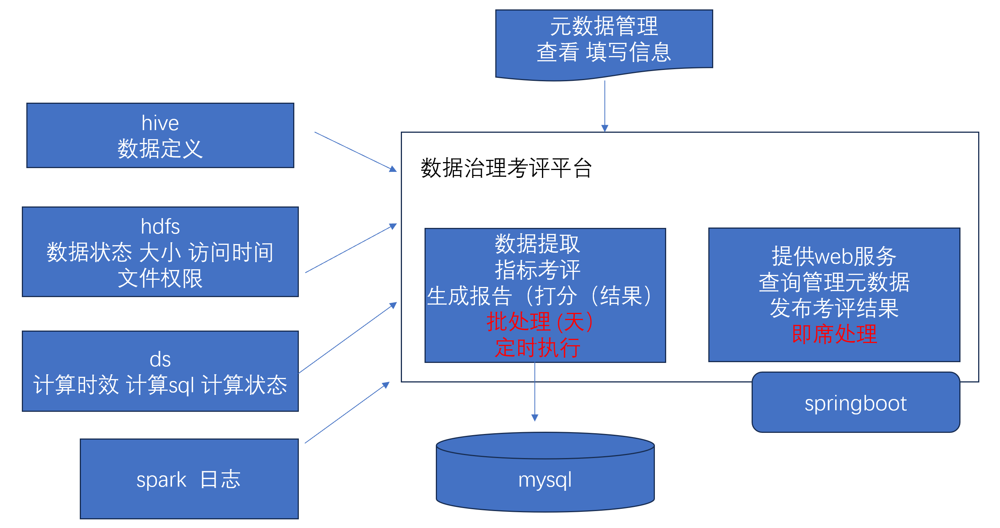
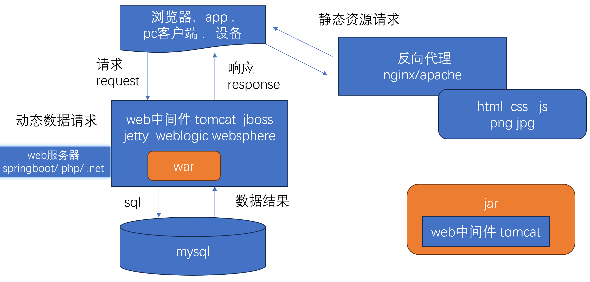
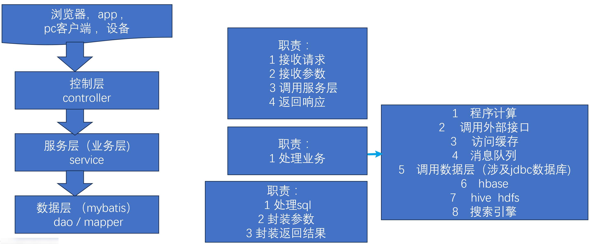
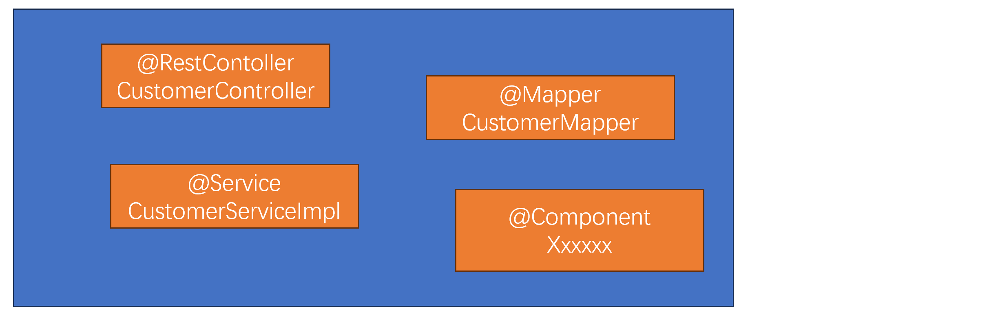
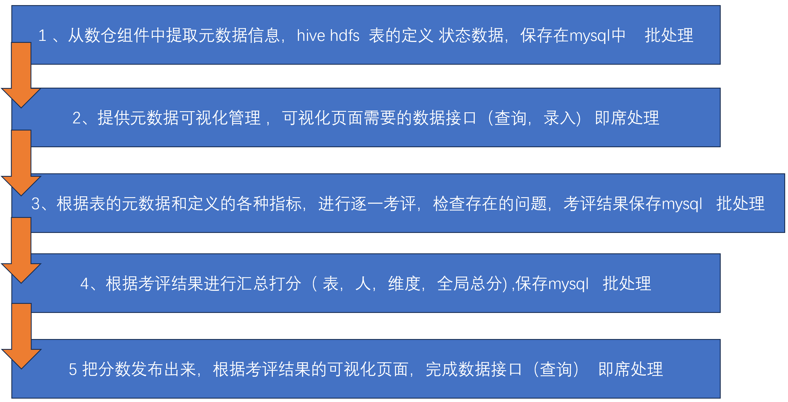
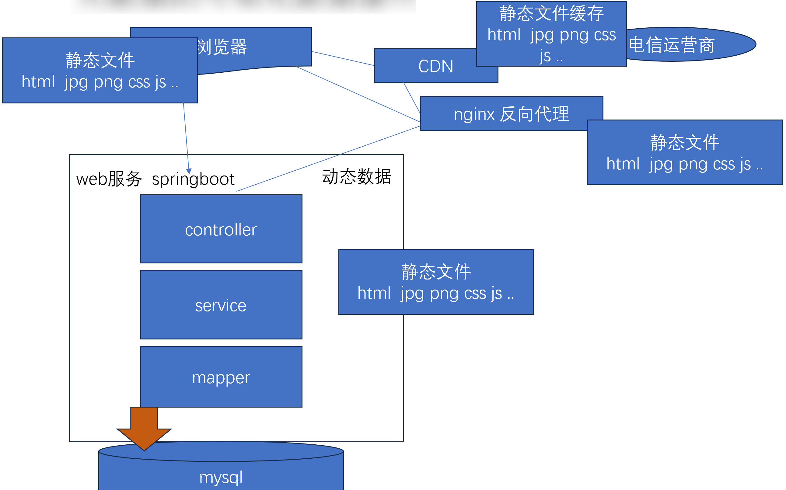
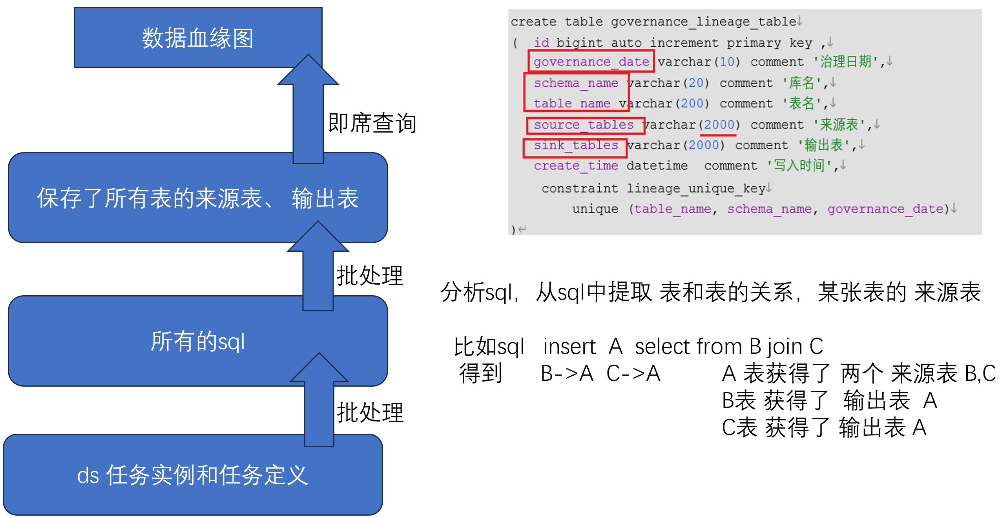

# 数据治理项目教学目标

1  学习 理解 数据治理的相关知识和理念  

2  针对离线数仓治理，让你的项目更真实，更高级

3  通过元数据的角度，理解数仓及其各类组件（hive,hdfs,ds, 日志）

4  提高编码能力

5  学习 基于springboot开发web服务

​	 1 大数据平台化（数据中台)    2 数据接口（数据大屏，第三方数据需求 等）


# 数据开发痛点及方案

痛点：质量，安全，规范，存储，计算 ...


方案1：数据中台

1 数据采集

2 数据定义

3 数据开发

4 数据调度 

5 数据血缘

6 元数据管理（数据资产)

7 数据权限 

8 数据生命周期

…  

优势：一套标准数据开发流程平台

弱点： 成本高

 

方案2：数据治理考评

通过各种考评指标，来对目前的数据开发情况进行考评、打分、排行榜，把考评出的问题暴露出来，倒逼开发人员进行改进。

优势： 成本低 ，直逼问题

弱点： 没有标准操作流程 


# 数据治理考评平台架构图




## 计算机处理方式

1 批处理 (无人交互）  spark , datax ,  hive ,  maxwell-bootstrap 

2 流处理 (无人交互）  flume ,  kafka ,  maxwell 

3 即席处理    有界面 控制台设置 业务系统  （时效、并发）


## 需要掌握技术点

1 springboot 架构 + mybatis 对接数据

2 java 对接相关数据组件 hive hdfs ds  spark日志，了解它们的元数据（底层是怎么存的）

3 小细节：处理json 

​          		日期处理

​          		正则表达式 

​          		如何访问web接口 

​          		多线程 

​          		sql语法树 分析


# Springboot及Mybatis 入门

课程代码 `demo_customer0315`


## Web服务




## Java Web框架

ssh   struts + spring + hibernate 

ssm  springmvc + spring + mybatis 

springboot

1 ssm 需要配置大量的xml 文件

   springboot 约定大于配置，大量的减少配置，没有一定要配的，根据需要 增加配置，而且所有配置集中在一个 

   文件中，application.properties / application.yml

2  集成了web中间件  

​    简化了打包、部署的方式 

3  集成了大量的第三方组件 


## 分层开发

1 提高计算的复用性    2 计算逻辑清晰




## 请求方式和参数接收

get  读操作

post  写操作 （非幂等操作)  postman

put  写操作 (幂等操作)

delete  删除

…

```java
@RestController
public class HelloController {

    // 1 键值对参数  场景：多个条件的查询  读
    @RequestMapping("/sayhello")
    public String sayHello(@RequestParam("name") String name, @RequestParam("age") Integer age) {
        return "Hello, name：" + name + ", age: " + age;
    }

    // 2 路径参数  场景：唯一性主键的查询  读
    @RequestMapping("/customer/{id}")
    public String getCustomerById(@PathVariable("id") String id) {
        return "customer, id: " + id;
    }

    // 3 请求体参数 requestBody requestEntity payload  写
//    @RequestMapping(value = "/customer", method = RequestMethod.POST)
    @PostMapping("/customer")
    public String saveCustomer(@RequestBody Customer customer) {
        return "customer: " + customer;
    }
}
```


## 单例的创建（spring 组件的创建）

懒汉  

​    使用时创建，不使用不创建 

​    好处：不使用的时候节省资源

​    存在并发创建的场景，加锁解决 


饿汉   （99%应用程序员的选择) （spring 的默认选择)

​    启动时创建

​    好处：提前创建，使用时直接使用现成的 

​               大量准备工作在启动时完成，使用阶段不必临时创建，提高用户体验 

​    线程安全


## spring 的容器与组件

组件： 以单例模式存在

​      	  容器启动时创建（饿汉)

​       	 启动后 ，根据 @Autowired 建立组件之间的调用关系

容器： 负责组件的全生命周期管理，类似于一个组件池




## mybatis能做什么

创建连接 connection    可以

创建会话 statement     可以

封装参数                可以

编写sql                  不行

执行sql                  可以

封装返回结果        可以 而且更好


## mybatis的sql

- sql 的定义 

  - 可以写 xml      

    - 好处：功能全 

    - 坏处：繁琐

  - 也可以写注解
    - 好处：直观、快捷、简单 

    - 弱点：功能没有 xml 全 


## mybatis的替代符

- #{ }   
  - 半自动  自动根据字段类型 决定是否补充单引
  - 传递是单纯的参数值 

- ${ }   
  -  手动   不会判断类型 会如实把值拼接在sql中
  - 传递包含了sql语句的语法 


## mybatis-plus

1 全面兼容mybatis 

2 补充了大量的现成方法，来完成对单表的插删改查


## 代码生成器

代码生成器-配置类 `GenCode3531.java`

模板替换 `templates/myentity.java.ftl`

依赖

```xml
<dependency>
    <groupId>com.baomidou</groupId>
    <artifactId>mybatis-plus-generator</artifactId>
    <version>3.5.3.1</version>
</dependency>

<dependency>
    <groupId>org.apache.velocity</groupId>
    <artifactId>velocity-engine-core</artifactId>
    <version>2.3</version>
</dependency>

<dependency>
    <groupId>org.springframework.boot</groupId>
    <artifactId>spring-boot-starter-freemarker</artifactId>
</dependency>
```


## java与数据库字段类型的对应

String  --  varchar 

BigDecimal  --  decimal(16,2)

Long   --  bigint 

java.util.Date 经典 or LocalDatetime 1.8   --  datetime


## 注意 组件与启动类的位置关系

启动类只能扫描和它同级的目录下的组件


## 在springboot中控制日志

- 日志框架  log4j    logback    logging(springboot) 

- 把所有日志进行了分级
  - trace   debug   info   warn   error   fatal


## 连接池

- 操作一次数据库的消耗

  - 1  建立连接的耗时  大 

  - 2  传输的耗时  一来一回  中

  - 3   mysql（根据主键进行查询、插入一条数据 ）执行的耗时 小 

- 数据库承担的并发
  - 企业中 mysql （中档型机器，一般的标准服务器128G内存）能承担500-1000并发
- 生产环境中一定要配连接池
  - 在配置文件中设置


## 动态数据源

如果 pom.xml中引入了连接池依赖  

而且 application.properties使用了动态数据源 

那么必须加入以下代码 把连接池的自动配置 关闭掉 spring.autoconfigure.exclude=com.alibaba.druid.spring.boot.autoconfigure.DruidDataSourceAutoConfigure


## 状态码

1xx     正在访问

2xx     200  访问成功

3xx     跳转 重定向 

4xx     客户端错误

​            400 bad request  参数不匹配   必填 参数类型

​        	404 not found  路径不匹配

​        	405 method not allowed     get post 请求不匹配

​        	403 权限  被禁用

5xx      500 服务器内部错误  直接看服务器的控制台 必有异常

​       	 503 服务不可用 代理无法跳转 

xxx     自定义


## 总结

Springboot 作为一个web应用快速开发框架，整合了SpringMVC、Spring、Mybatis等框架。其中：

SpringMVC负责接收返回web请求。

Spring负责把业务处理类的组件化，管理生命周期。

Mybatis负责连接数据库、封装参数、封装结果。

Mybatis-plus是Mybatis的第三方扩展依赖，可以 方便的对数据单表进行插删改查操作。

Mybatis-plus 提供了代码生成器generator ，辅助我们快速生成基础代码。

DynamicDatasource是用来对接多个jdbc数据源的工具。

Druid 是一个非常好用的数据连接池，可以使得数据连接循环利用减少开销。


# Java开发技巧

## 修改代码是否每次都需要重启服务

1  增改类名 方法名 注解 配置文件 都需要重启 

2  修改 方法里的内容  只需要编译一下即可 ctrl+F9


## 优化效率

- io  网络  磁盘       百倍到千倍的优化效果       大

- 内存   降低GC      效果一般般         中 

- cpu        小


## Java代码的小工具包

lang3   apache 

guava   google


## json工具

- gson  google 

- Jackson  apache   springboot自带

- fastjson  Alibaba  更方便 

```java
// fastjson

// Java对象转为json字符串
JSON.toJSONString( )

    
// json字符串转为Java对象
//单值对象：字符串是  { } 包裹                   
//        1  通用对象  hashmap , JSONObject(类似hashmap)
//        2  专用对象  Java Bean
JSON.parseObject(  ) 
    
//集合对象：字符串是 [ ] 包裹              
//    	  1  List<通用对象>   
//    	  2  List<专用对象>
//    	  3  JSONArray 类似List        
JSON.parseArray(  ) 
```


## 日期工具 lang3

```java
// DateUtils  
// 把日期字符串转为对象 parseDate
Date xxxDateDt = DateUtils.parseDate(日期字符串, "yyyy-MM-dd");
// 把某个时间精度以下抹除 truncate
Date xxxDateDt = DateUtils.truncate(日期对象, Calendar.DATE);


// DateFormatUtils  
// 把日期对象转为字符串
//创建日期   秒数 --> 毫秒 --> Date -->  年-月-日 时：分：秒
String xxxTimeStr = DateFormatUtils.format(new Date(), "yyyy-MM-dd HH:mm:ss");

```


## 正则表达式

- 用于 判断一个字符串是否符合某种规范 
  
- 程序员可以通过表达式来定义 规范
  
- [ ] 限定某个字符可以是什么   [123] [0-9] [a-z] [A-Z] [0-9A-Za-z@#]    . 所有字符  

- { } 限定字符的个数   {2,3} {3,} {,3}  

  - {0,}    ?{0,1}   + {1,}  

  - 至少有一个英文   [a-zA-Z]+ 

    任意字符而且没有个数限制    .*  

    任意字符 至少一个      .+   

    至少一位数字       \d+ 

    至少一位(英文数字下划线)     \w +

    [a-zA-Z]{2,10}

-  ^ 开头字符  $结尾 

- （） 限定字符串  (com|org|cn)$  字符串式 几种组合作为结尾


邮箱：^\w+@\w{2,10}\.(com|org|cn)$ 

ip地址：[1-2] ?[0-5]?[0-9]\. [1-2] ?[0-5]?[0-9]\. [1-2] ?[0-5]?[0-9]\. [1-2] ?[0-5]?[0-9]

```java
public static void main(String[] args) {
    //1定义表达式
    Pattern emailPattern = Pattern.compile("^\\w+@\\w{2,10}\\.(com|org|cn)$");
    //2放入要比较的字符串
    Matcher zhang3Matcher = emailPattern.matcher("zhang3@atguigu.io");
    //3 执行比较
    if(zhang3Matcher.matches()){
        System.out.println("格式正确");
    }else{
        System.out.println("格式不正确");
    }
}
```


# 元数据、考评

DGA 项目

Data Governance Assess


## 开发内容步骤




## 1 元数据的加载与处理

### 获取配置参数、后置构造器

Java启动时 要执行的代码 优先级要 高于spring框架启动时要执行的代码

调整顺序 ：先执行 @Value，再执行创建客户端的方法，也是启动时执行 

Java的启动方法 --> @Value --> @PostConstruct

```java
@Service
@DS("dga")
public class TableMetaInfoServiceImpl extends ServiceImpl<TableMetaInfoMapper, TableMetaInfo> implements TableMetaInfoService {
    
    @Value("${dga.meta.url}")  // 容器启动时执行
    String metaUrl;

    HiveMetaStoreClient hiveMetaStoreClient ;
    
    @PostConstruct   //后置构造器  容器启动时执行，最后执行
    public   void   initMetaClient()      {
        HiveConf hiveConf = new HiveConf();
        hiveConf.setVar(HiveConf.ConfVars.METASTOREURIS, metaUrl);
        try {
            hiveMetaStoreClient = new HiveMetaStoreClient(hiveConf);
        } catch (MetaException e) {
            throw new RuntimeException(e);
        }
    }
    
}
```


### 提取hive信息

```java
// 从hive中提取数据
private TableMetaInfo getTableMetaFromHive(String schemaName, String tableName) throws  Exception {
    Table table = hiveMetaStoreClient.getTable(schemaName, tableName);
    System.out.println("table = " + table);
    TableMetaInfo tableMetaInfo = new TableMetaInfo();
    tableMetaInfo.setTableName(tableName);
    tableMetaInfo.setSchemaName(schemaName);

    // 过滤器 用于调整json转换过程中保留的字段
    PropertyPreFilters.MySimplePropertyPreFilter preFilter = new PropertyPreFilters().addFilter("name", "type", "comment");
    //列转换   // name  type  comment
    List<FieldSchema> fieldList = table.getSd().getCols();
    String colJsonString = JSON.toJSONString(fieldList,preFilter);
    tableMetaInfo.setColNameJson(colJsonString);
    //分区列转换
    List<FieldSchema> partitionKeyList = table.getPartitionKeys();
    String partitionColJsonString = JSON.toJSONString(partitionKeyList,preFilter);
    tableMetaInfo.setPartitionColNameJson(partitionColJsonString);

    //力气活
    // 所有者
    tableMetaInfo.setTableFsOwner( table.getOwner());
    //杂项参数
    Map<String, String> tableParameters = table.getParameters();
    String paramJson = JSON.toJSONString(tableParameters);
    tableMetaInfo.setTableParametersJson(paramJson);

    //备注
    String comment = table.getParameters().get("comment");
    tableMetaInfo.setTableComment(comment);
    //路径
    String location = table.getSd().getLocation();
    tableMetaInfo.setTableFsPath(location);

    //格式
    tableMetaInfo.setTableInputFormat(table.getSd().getInputFormat());
    tableMetaInfo.setTableOutputFormat(table.getSd().getOutputFormat());
   	tableMetaInfo.setTableRowFormatSerde(table.getSd().getSerdeInfo(). getSerializationLib());

    //创建日期   秒数 -->毫秒  --> Date-->   年-月-日 时：分：秒
    String createTimeStr = DateFormatUtils.format(new Date(table.getCreateTime() * 1000L), "yyyy-MM-dd HH:mm:ss");
    tableMetaInfo.setTableCreateTime(createTimeStr);

    //表类型
    tableMetaInfo.setTableType(table.getTableType());

    //分桶
    tableMetaInfo.setTableBucketColsJson(JSON.toJSONString(table.getSd(). getBucketCols()));
   tableMetaInfo.setTableSortColsJson(JSON.toJSONString(table.getSd().getSortCols()));
    tableMetaInfo.setTableBucketNum(table.getSd().getNumBuckets()+0L);

    return tableMetaInfo;
}
```


### hdfs信息提取-递归

递归的思路

- 递归的三个 准备工作  
  - 递归起始的节点 
  - 递归过程使用的工具
  - 存放递归最终结果的容器
- 一定是一个选择
  - 非叶子节点   
    - 可能也会有 处理自己业务逻辑
    - 指向下一个子节点，调用自己的方法 
  - 叶子节点 
    - 处理自己业务逻辑（累加变量中）
    -  可以返回 或者 直接结束        

```java
// 从hdfs中补充元数据信息
private void addHdfsInfo(TableMetaInfo tableMetaInfo) throws  Exception {
    //递归的三个 准备工作   
    //1  如何从hdfs中获取数据 客户端工具？Hadoop包下的 FileSystem
    FileSystem fileSystem = FileSystem.get(new URI(tableMetaInfo.getTableFsPath()), new Configuration(), tableMetaInfo.getTableFsOwner());
    FileStatus[] tableFilesStatus = fileSystem.listStatus(new Path(tableMetaInfo.getTableFsPath()));

    addFileInfoRec(tableFilesStatus,fileSystem,tableMetaInfo);

    tableMetaInfo.setFsCapcitySize(fileSystem.getStatus().getCapacity());
    tableMetaInfo.setFsUsedSize(fileSystem.getStatus().getUsed());
    tableMetaInfo.setFsRemainSize(fileSystem.getStatus().getRemaining());
}

// 递归方法
private void addFileInfoRec(FileStatus[] tableFilesStatus, FileSystem fileSystem, TableMetaInfo tableMetaInfo) throws IOException {
    
    for (FileStatus filesStatus : tableFilesStatus) {
        if( filesStatus.isDirectory()){
            // 非叶子节点(目录)
            //    可能也会有处理
            //    指向下一个子节点  调用自己的方法
            FileStatus[] subFileStatus = fileSystem.listStatus(filesStatus.getPath());
            addFileInfoRec(subFileStatus,fileSystem,tableMetaInfo);
        }else{
            // 叶子节点(文件)
            //    处理自己业务逻辑（累加变量中）
            Long tableNewSize =tableMetaInfo.getTableSize()+filesStatus.getLen();
            tableMetaInfo.setTableSize(tableNewSize);

            // 结合副本数的文件大小
            long tableNewTotalSize = tableMetaInfo.getTableTotalSize() + filesStatus.getLen() * filesStatus.getReplication();
            tableMetaInfo.setTableTotalSize(tableNewTotalSize);
            // 比较：比较当前文件的最后修改时间 和 之前文件的最大的最后修改时间
            if(tableMetaInfo.getTableLastModifyTime()==null){
                tableMetaInfo.setTableLastModifyTime(new Date(filesStatus.getModificationTime()));
            }else{
                // 保留两者中较大值
                if( tableMetaInfo.getTableLastModifyTime().compareTo(new Date(filesStatus.getModificationTime()))<0){
                    tableMetaInfo.setTableLastModifyTime(new Date(filesStatus.getModificationTime()));
                }
            }
            // 比较：比较当前文件的最后访问时间 和 之前文件的最大的最后访问时间
            if(tableMetaInfo.getTableLastAccessTime()==null){
                tableMetaInfo.setTableLastAccessTime(new Date(filesStatus.getAccessTime()));
            }else{
                // 保留两者中较大值
                if( tableMetaInfo.getTableLastAccessTime().compareTo(new Date(filesStatus.getAccessTime()))<0){
                    tableMetaInfo.setTableLastAccessTime(new Date(filesStatus.getAccessTime()));
                }
            }
            // 可以返回 或者 直接结束
        }
    }
}
```


### 辅助信息初始化

```java
@Service
@DS("dga")
public class TableMetaInfoExtraServiceImpl extends ServiceImpl<TableMetaInfoExtraMapper, TableMetaInfoExtra> implements TableMetaInfoExtraService {

    public  void  initTableMetaExtra(String assessDate, List<TableMetaInfo> tableMetaInfoList){
            //1 检查 要生成哪些辅助信息表  只初始化没生成的tableMetaInfoList
        List<String> tableNameList = tableMetaInfoList.stream().map(tableMetaInfo -> tableMetaInfo.getSchemaName() + "." + tableMetaInfo.getTableName()).collect(Collectors.toList());
          // select xxx from table_meta_info_extra where   concat(schema_name,',',table_name ) in ('gmall.dwd_order_info','gmall.ods_order_info')
        List<TableMetaInfoExtra> existsExtraList = this.list(new QueryWrapper<TableMetaInfoExtra>().in("concat(schema_name,'.',table_name)", tableNameList));
        Set<String> existsExtraSet = existsExtraList.stream().map(tableMetaInfoExtra -> tableMetaInfoExtra.getSchemaName() + "." + tableMetaInfoExtra.getTableName()).collect(Collectors.toSet());

        tableMetaInfoList.removeIf(tableMetaInfo->existsExtraSet.contains(tableMetaInfo.getSchemaName()+"."+tableMetaInfo.getTableName())  );

        List<TableMetaInfoExtra> tableMetaInfoExtraList=new ArrayList<>(tableMetaInfoList.size());
        //2  初始化 没有曾经初始化过的表
        for (TableMetaInfo tableMetaInfo: tableMetaInfoList) {
            TableMetaInfoExtra tableMetaInfoExtra = new TableMetaInfoExtra();
            tableMetaInfoExtra.setTableName(tableMetaInfo.getTableName());
            tableMetaInfoExtra.setSchemaName(tableMetaInfo.getSchemaName());

            tableMetaInfoExtra.setLifecycleType(MetaConst.LIFECYCLE_TYPE_UNSET);
            tableMetaInfoExtra.setLifecycleDays(-1L);

            tableMetaInfoExtra.setSecurityLevel(MetaConst.SECURITY_LEVEL_UNSET);
            tableMetaInfoExtra.setDwLevel(getInitDwLevelByTableName(tableMetaInfo.getTableName()));

            tableMetaInfoExtra.setCreateTime(new Date());

            tableMetaInfoExtraList.add(tableMetaInfoExtra);
        }
        //3 保存到数据库中
        saveBatch(tableMetaInfoExtraList);
    }

    private String getInitDwLevelByTableName(String tableName){
        if(tableName.startsWith("ods")){
            return "ODS";
        } else if (tableName.startsWith("dwd")) {
            return "DWD";
        }else if (tableName.startsWith("dim")) {
            return "DIM";
        }else if (tableName.startsWith("dws")) {
            return "DWS";
        }else if (tableName.startsWith("ads")) {
            return "ADS";
        }else if (tableName.startsWith("dm")) {
            return "DM";
        }else  {
            return "OTHER";
        }
    }

}
```


### 方法调用

```java
@Service
@DS("dga")
public class TableMetaInfoServiceImpl extends ServiceImpl<TableMetaInfoMapper, TableMetaInfo> implements TableMetaInfoService {
    
    @Autowired
    TableMetaInfoExtraService tableMetaInfoExtraService;
    
    public void  initTableMetaInfo(String assessDate,String schemaName) throws  Exception {
        // 清理当日已经存在的数据
        this.remove(new QueryWrapper<TableMetaInfo>().eq("assess_date",assessDate));

        List<String> alltableNameList = hiveMetaStoreClient.getAllTables(schemaName);

        System.out.println("alltableNameList = " + alltableNameList);

        List<TableMetaInfo> tableMetaInfoList=new ArrayList<>(alltableNameList.size());
        for (String tableName : alltableNameList) {
            //1 从hive中提取数据
            TableMetaInfo tableMetaInfo = getTableMetaFromHive(schemaName, tableName);
            //2  从hdfs中补充元数据信息
            addHdfsInfo(tableMetaInfo);
            //3  日期信息
            tableMetaInfo.setCreateTime(new Date());
            tableMetaInfo.setAssessDate(assessDate);

            tableMetaInfoList.add(tableMetaInfo);
        }
      
        saveBatch(tableMetaInfoList,500);
        
        //4 初始化 辅助信息表
        tableMetaInfoExtraService.initTableMetaExtra(assessDate,tableMetaInfoList);
    }
    
}
```


### Set 和 list 判存的区别

Set   contains时间复杂度是O(1)    hashmap.get

List 是O(N)


时间复杂度 ？ O(1) O(N) O(logN) O(N^2) O(NlogN)  

数据量 与操作次数的关系 

O(1)  根据key 查询hashMap，根据下标取数组 或者 arraylist 的值

O(N)  根据值查询数组、列表的元素， 根据下标取linkedlist的值

O(logN) 有序数组的查询值  二叉树的查询  B+树的索引 

​              根据数据量的增长有限度的增加 

O(N^2)   简单 排序 ： 冒泡 选择 插入 

O(NLogN)  快排 归并 堆 …


hashmap 树 红黑树 本质二叉树    mysql 为什么不用二叉树


## 2 各表元数据的页面接口

### 元数据的可视化数据接口




### 可视化页面部署

1、把资料中的前端页面 拷贝到springboot下的 static

2、把 host 中添加映射 127.0.0.1   dga.gmall.com

 

### 思考 需求的弹性部分

作为开发人员，写代码时要考虑到需求可能会发生变化，参数不要写死


### 各种 bean 类

bean / POJO / entity 

VO    view object  用于传递前端可视化数据的对象

DO   data object  和数据库一致对象 

Query对象   放查询条件


### 代码中的注意事项

1 sql注入问题 

2 不要循环操作数据库

3 String 不要频繁拼接  StringBuilder StringBuffer

4 注意扩容，提前预留空间

5 使用容器时 list set hashmap 注意使用时间复杂度更好的


### 关于bean的mybatis-plus注解

```java
@TableName(“table_meta_info”)   
// 声明bean对应数据库的表名 ，不填默认使用类名转为下划线结构作为表名 

@TableId(value = "id", type = IdType.AUTO)   
// 声明主键的生成方式   AUTO就是使用mysql 的自增序列

@TableField(exist = false)
// 声明该java字段 不是数据库的字段

```


### 列表查询

**Controller 层**

```java
@RestController
@RequestMapping("/tableMetaInfo")
public class TableMetaInfoController {
    
    @Autowired
    TableMetaInfoService tableMetaInfoService;
    
    @GetMapping("/table-list")
    public String getTableList( TableMetaInfoForQuery tableMetaInfoForQuery){   	//springboot 会把键值对参数 自动封装到对象中 不需要注解

        List<TableMetaInfoVO> tableMetaInfoVOList = tableMetaInfoService.getTableListForPage(tableMetaInfoForQuery);

        Integer total= tableMetaInfoService.getTableTotalForPage(tableMetaInfoForQuery);

        Map<String,Object> resultMap=new HashMap<>();

        resultMap.put("total",total);
        resultMap.put("list",tableMetaInfoVOList);

        return JSON.toJSONString(resultMap)  ;

    }
    
}
```

**Service 层**

```java
@Service
@DS("dga")
public class TableMetaInfoServiceImpl extends ServiceImpl<TableMetaInfoMapper, TableMetaInfo> implements TableMetaInfoService {	
	// 根据查询条件和分页 来 进行列表查询
    //  mybatis
    //  select xxx  from table_meta_info tm  join table_meta_info_extra te
    //  on tm.table_name=te.table_name  and  tm.schema_name=te.schema_name
    //  where  tm.schema_name  like '%%'
    //       and tm.table_name like '%xx%'
    //       and dw_level = ''
    //       and assess_date = (select max(assess_date) from table_meta_info tm1
    //       where tm.table_name =tm1.table_name and tm.schema_name =tm1.schema_name)
    @Override
    public List getTableListForPage(TableMetaInfoForQuery tableMetaInfoForQuery) {
        StringBuilder sqlSb=new StringBuilder(200);

        sqlSb.append("select tm.id ,tm.table_name,tm.schema_name,table_comment,table_size,table_total_size,tec_owner_user_name,busi_owner_user_name, table_last_access_time,table_last_modify_time" +
                " from table_meta_info tm  join table_meta_info_extra te " +
                "     on tm.table_name=te.table_name  and  tm.schema_name=te.schema_name");
        sqlSb.append(" where assess_date = (select max(assess_date) from table_meta_info tm1\n" +
                "       where tm.table_name =tm1.table_name and tm.schema_name =tm1.schema_name  )");

        if(tableMetaInfoForQuery.getTableName()!=null&&tableMetaInfoForQuery.getTableName().trim().length()>0){
            sqlSb.append("and tm.table_name like '%").append(SqlUtil.filterUnsafeSql(tableMetaInfoForQuery.getTableName())).append("%'");
        }
        if(tableMetaInfoForQuery.getSchemaName()!=null&&tableMetaInfoForQuery.getSchemaName().trim().length()>0){
            sqlSb.append("and tm.schema_name like '%").append(SqlUtil.filterUnsafeSql(tableMetaInfoForQuery.getSchemaName())).append("%'");
        }
        if(tableMetaInfoForQuery.getDwLevel()!=null&&tableMetaInfoForQuery.getDwLevel().trim().length()>0){
            sqlSb.append("and te.dw_level = '").append(SqlUtil.filterUnsafeSql(tableMetaInfoForQuery.getDwLevel())).append("'");
        }

     	// 分页  limit   xx,xx
        // 页码换算成行号   行号= （页码-1 ）* 每页行数
        int rowNo= (tableMetaInfoForQuery.getPageNo()-1)*tableMetaInfoForQuery.getPageSize();

        sqlSb.append(" limit "+rowNo+","+ tableMetaInfoForQuery.getPageSize());

        List<TableMetaInfoVO> tableMetaInfoVOList = this.baseMapper.selectTableMetaListPage(sqlSb.toString());

        return tableMetaInfoVOList;
    }

    @Override
    public Integer getTableTotalForPage(TableMetaInfoForQuery tableMetaInfoForQuery) {
        StringBuilder sqlSb=new StringBuilder(200);

        sqlSb.append("select   count(*) " +
                " from table_meta_info tm  join table_meta_info_extra te " +
                "     on tm.table_name=te.table_name  and  tm.schema_name=te.schema_name");
        sqlSb.append(" where assess_date = (select max(assess_date) from table_meta_info tm1\n" +
                "       where tm.table_name =tm1.table_name and tm.schema_name =tm1.schema_name  )");

        if(tableMetaInfoForQuery.getTableName()!=null&&tableMetaInfoForQuery.getTableName().trim().length()>0){
            sqlSb.append("and tm.table_name like '%").append(SqlUtil.filterUnsafeSql(tableMetaInfoForQuery.getTableName())).append("%'");
        }
        if(tableMetaInfoForQuery.getSchemaName()!=null&&tableMetaInfoForQuery.getSchemaName().trim().length()>0){
            sqlSb.append("and tm.schema_name like '%").append(SqlUtil.filterUnsafeSql(tableMetaInfoForQuery.getSchemaName())).append("%'");
        }
        if(tableMetaInfoForQuery.getDwLevel()!=null&&tableMetaInfoForQuery.getDwLevel().trim().length()>0){
            sqlSb.append("and te.dw_level = '").append(SqlUtil.filterUnsafeSql(tableMetaInfoForQuery.getDwLevel())).append("'");
        }

        Integer total = this.baseMapper.selectTableMetaTotalPage(sqlSb.toString());

        return total;
    }
    
}
```


### 单表查询

**Controller 层**

```java
@RestController
@RequestMapping("/tableMetaInfo")
public class TableMetaInfoController {
   
    @GetMapping("/table/{tableId}")
    public String  getTableMeta(@PathVariable("tableId") Long tableId){
       TableMetaInfo tableMetaInfo = tableMetaInfoService.getTableMetaInfo(tableId);
       return JSON.toJSONString(tableMetaInfo);
    }
    
}
```

**Service 层**

```java
@Service
@DS("dga")
public class TableMetaInfoServiceImpl extends ServiceImpl<TableMetaInfoMapper, TableMetaInfo> implements TableMetaInfoService {
    
    // 1  根据主键查询主表信息
    // 2  根据表名+库名 查询辅助信息
    @Override
    public TableMetaInfo getTableMetaInfo(Long tableId) {
        TableMetaInfo tableMetaInfo = getById(tableId);

        TableMetaInfoExtra tableMetaInfoExtra = tableMetaInfoExtraService.getOne(new QueryWrapper<TableMetaInfoExtra>()
                .eq("table_name", tableMetaInfo.getTableName())
                .eq("schema_name", tableMetaInfo.getSchemaName()));

        tableMetaInfo.setTableMetaInfoExtra(tableMetaInfoExtra);
        return tableMetaInfo;
    }
    
}
```


### 保存辅助信息

**Controller 层**

```java
@RestController
@RequestMapping("/tableMetaInfo")
public class TableMetaInfoController {
    @Autowired
    TableMetaInfoExtraService tableMetaInfoExtraService;
    
    @PostMapping("/tableExtra")
    public String saveTableExtra(@RequestBody TableMetaInfoExtra tableMetaInfoExtra){
        tableMetaInfoExtra.setUpdateTime(new Date());
        tableMetaInfoExtraService.saveOrUpdate(tableMetaInfoExtra);
        return  "success";
    }
    
}
```


## 3 数据治理考评

### 考评的步骤

1  查询出 要考评的表（最新的元数据 含辅助信息） List< TableMetaInfo > 

2  查询出 要考评的指标列表  List< GovernanceMetric >

3  ds信息

4  每张表 的 每个指标 逐一 进行考评 

​    通过两个列表的双层循环 遍历  List < GovernanceAssessDetail >

5  保存 到mysql数据库中


### join 结果映射

- 通过 mybatis join完成的查询的结果，可以直接封装到一个bean中

- 如何把join结果封装到一个父子嵌套的bean中？
  - 要使用xml 做 resultMap 结果映射 
  - @ResultMap  让方法找到xml中的结果映射
  - xml 
    - 1  可以复制 代码生成器的xml 内容 到 resource mapper目录中
    - 2  join 操作，大概率会遇到两个表的字段重名，通过别名把重名字段分开，而且在xml中显性声明 
    - 3  所有按照驼峰 -> 下划线的标准映射可以省略，autoMapping =true
    - 4  application.properties 声明xml位置，automapping 的使用范围


### 设计模式 - 模板模式

1  由父类对整个程序进行主控制 

2  由子类 实现其核心步骤 

https://www.w3cschool.cn/shejimoshi/template-pattern.html

《大话设计模式》  《大话数据结构》


- 原则：开闭原则
  - 对扩展开放 ，对修改封闭 

- 把指标的考评 组件化 
  - 每个指标的考评 都封装成独立的考评器 
  - 效果：每增加一个需求
    - 1 数据库表中增加一条指标定义
    - 2 按照固定的模板增加一个指标考评器（类)

- 如何通过一个指标名称，来实例化一个指标考评·器
  - 方案1：反射 根据字符创建类的对象 调用方法
  - 方案2：通过字符串名称 找到对应已经实例化好的组件 可以直接使用


### 设计模式 - 建造者模式

一种替代new 方式创建对象的模式

避免 因为构造函数参数过多带来的 对齐问题，构造函数如果参数发生了变化（个数，顺序），而影响 new 方法的定义

Builder方式构建时会以指定名称的方式填写构造参数 ，如果构造函数发生了变化 也不会影响builder的创建。

 XXX xx=  new XXX.Builder().xx().xx().xx().build();


### 动态装配

- @Autowired  提前明确的知道 要 装配哪个组件的实例，在代码中明确声明。装配时机，容器启动之后 

- 不能明确知道要装配哪个类，通过代码运算过程中获得的字符串，来获知组件名称，通过字符串组件名称从容器中获得组件的实例


### 指标-表产出数据量监控

思路

1  定义 指标

2  考评器类

3  计算出 当天的产出目录名称   前n天每天的产出目录名

4  通过目录名访问hdfs 遍历 获得该目录的大小 

5  当天数据产出/前n天的平均值 == 比例

6  占比 和  上下限参考值对比，  范围内 过 不在范围 给0分 差评


### 需要对接ds的指标

1、任务的定义

​       SQL    

2、任务的实例（运行情况)

​      任务状态   成功 异常 

​      任务耗时 

​      yarn_id 


### dolphinscheduler

1  启动，生产环境如果用standalone 启动，会丢失yarn_id。集群方式 可以抓取yarn_id 

2  ds 2.x 集群方式可以抓取yarn_id，ds3.x 抓不到yarn_id  可修复 

3  部署流程 每个表一个节点 

4  要选择shell 节点   hive –e  

​    sql 节点(不推荐)  通过jdbc ->hiveserver2 -> yarn （会丢失yarn_id）

5  为了方便元数据表 关联 任务定义和任务实例   约定：任务流程中的节点名称  使用 数据库名.表名


### 如何分析sql语句

- 1 要利用工具把sql转换为语法树
  - 需要使用hive提供的工具包 来解析       【通用逻辑】

- 2 通过分析结构化的语法树来提取sql中的信息
  - hive也同时提供了遍历工具       【通用逻辑】
  - 实现一个节点处理器 用于对每个节点收集数据 收集到一个或者多个容器 （list\set\map)      【定制逻辑】
  - 看容器中最终存储的数据 来对sql定性     【定制逻辑】


### 二叉树的遍历

1  前序遍历   根左右   之前hdfs手写 递归

2  中序遍历   左根右   二叉树

3  后序遍历   左右根   语法树的遍历方式


### 数据倾斜

- yarn 产生的spark日志

  - yarn 历史服务器 负责写入日志

  - spark 历史服务  负责解读日志 

    - 1  可视化页面

    - 2  日志数据接口(api)

      ​     

- 如何通过接口 检查是否数据倾斜

  - 获得attemptId 哪次尝试id是成功的

    http://hadoop102:18080/api/v1/applications/application_1682294710257_0090   

  - 获得成功的stage的清单 

    [http://hadoop102:18080/api/v1/applications/application_1682294710257_0090/](http://hadoop102:18080/api/v1/applications/application_1682294710257_0090/1/stages)[1](http://hadoop102:18080/api/v1/applications/application_1682294710257_0090/1/stages)[/stages](http://hadoop102:18080/api/v1/applications/application_1682294710257_0090/1/stages) 

  - 获得某个stage的任务信息 ，通过比较任务的duration 来判断是否存在倾斜

    [http://hadoop102:18080/api/v1/applications/application_1682294710257_0090/1/stages/](http://hadoop102:18080/api/v1/applications/application_1682294710257_0090/1/stages/1)[1](http://hadoop102:18080/api/v1/applications/application_1682294710257_0090/1/stages/1)  


- 如何在java程序中访问http接口
  - 场景：对于数据的识别 可能需要调用第三方服务 
  - 工具：HttpClient      OkHttp       RestTemplate（Spring自带)


### 优化：充分利用资源 内存 cpu

找到整个程序中没有依赖关系的任务，并行化，利用多线程 

如果 找到了可并行的任务，之后需要对任务的结果进行归集计算 

把并行的任务 通过 异步编排 提交到异步线程执行  形成Future ，然后再通过future.join操作实现归集 


### 异步编排

```java
public static void main(String[] args) throws InterruptedException {
    // 计算每个数的平方数 ，再累加起来
    Integer[]  nums={1,2,3,4,5,6};
    long startMs = System.currentTimeMillis();
    List<CompletableFuture<Integer>> futureList=new ArrayList<>();
    // List<Integer> num2List=new ArrayList<>();
    for (Integer num : nums) {   //计算平方
        //异步编排
        CompletableFuture<Integer> future = CompletableFuture.supplyAsync( ()-> {
            Integer num2 = num * num;
            try {
                Thread.sleep(1000);
            } catch (InterruptedException e) {
                throw new RuntimeException(e);
            }
            return num2;
        });
        futureList.add(future);
        // num2List.add(num2);  //现货列表
    }
    // 期货的兑现
    List<Integer> num22List = futureList.stream().map(future -> future.join()).collect(Collectors.toList());
    Integer sum=0;
    for (Integer num : num22List) {
        sum+=num;
    }

    System.out.println(" 耗时：" +(System.currentTimeMillis()-startMs)) ;
    System.out.println("sum = " + sum);  //汇总
}
```


# 数据血缘

## 数据血缘图的思路




