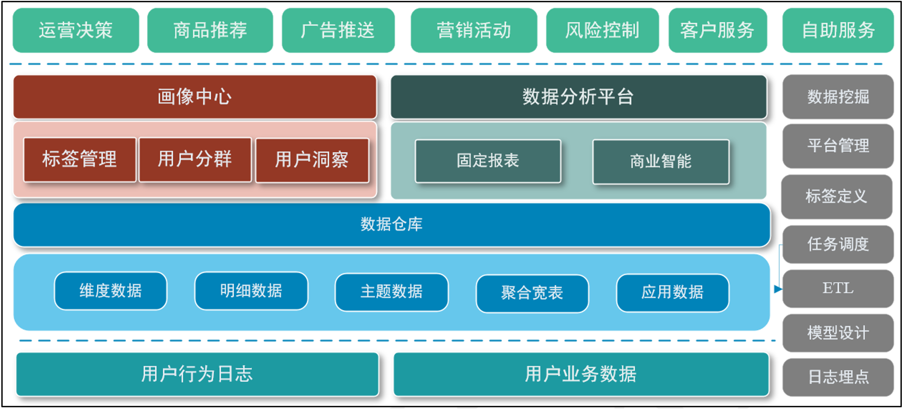
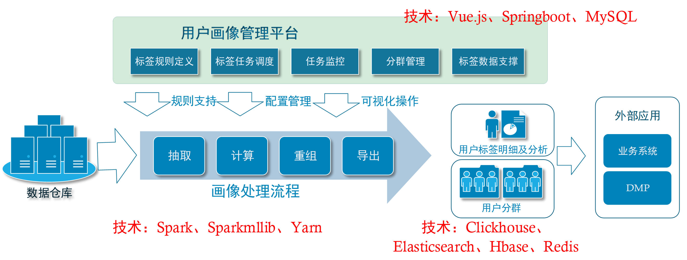
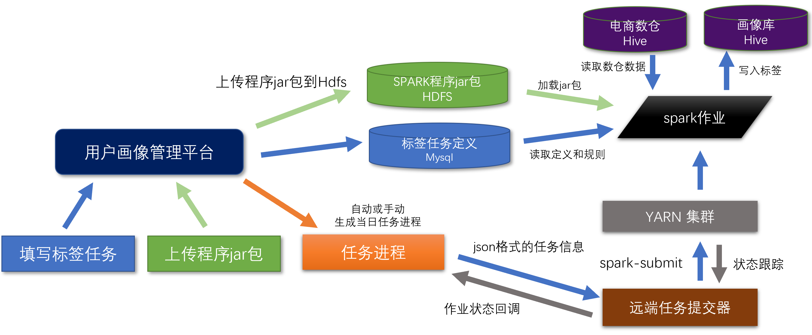
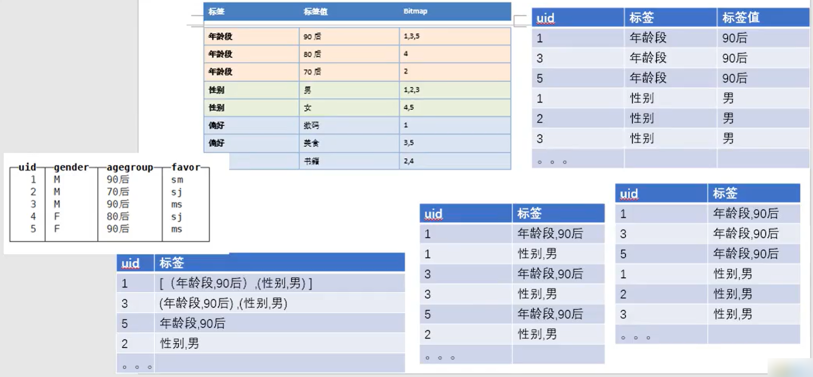

# 用户画像简介

## 定位与应用

- 定位：用户画像是一种数据服务

- 应用：

  - 运营决策  

    了解用户群体，聚焦目标用户，定位产品方向。

  - 精准营销 

    营销活动推送、广告投放、个性化推荐。

  - 分群洞察

    寻找高价值用户，挽留待流失用户，提升用户活跃。




## 架构




## 项目教学模块

（1）理解用户画像系统的设计思路，以及标签的设计流程与应用。

（2）用户画像管理平台的搭建及使用。

（3）掌握用户画像平台的数据库表，包括标签表、任务表、进度表等全部表含义。

（4）使用spark开发标签计算、重组、导出等操作，完成标签计算的业务处理流程。 

（5）利用clickhouse\Redis实现对画像数据的存储及多个标签的组合筛选。

（6）学习用Springboot、Mybatis等框架，完成用户分群功能。

（7）入门机器学习，用sparkmllib中的算法完成挖掘类标签的开发。


# 批处理任务开发

## 任务一：统计型和规则型标签的SQL处理

### 总体处理流程




**远端任务提交器**：

获取方式一：本课程提供的（尚硅谷自研）

获取方式二：开源组件  https://livy.incubator.apache.org/


### maven 依赖范围

> 视频坐标：p21，24min

- compile：主程序和测试程序都能用，参与打包
- test：测试程序能用，不参与打包
- provided：主程序和测试程序能用，只在编译期有效，不参与打包


## 任务二：标签的宽表合并

### 将多个表合并成一个宽表

方式 1：join

方式 2：union  -->  group by  -->  sum if

方式 3：pivot  【spark-sql 特有关键词】


### pivot 原理

把整个表整理成3种列：维度列、旋转列、聚合列

1）格式

```sql
select * 
from tablename pivot ( sum(聚合列) as 列标识  for 旋转列 in( 旋转列值1 ,旋转列值2,旋转列值3) ) 
```

2）旋转列

原来是某个列的行值，现在要从行值要转为列的字段

3）聚合列

对于旋转后的新列，要聚合的值

4）除了旋转列和聚合列，默认都是维度列，如果存在这三种以外的字段，需要提前用子查询去除


## 任务三：数据迁移至Clickhouse

### 幂等

去重  ==> 幂等  ==> 一般是实时处理中

离线计算中如果要考虑幂等，一般是选择将上次计算失败的残留数据直接清空。


## 任务四：在Clickhouse中将宽表转换为Bitmap表

### 转换过程




# 即席分群开发

## 五个功能 

1 将分群信息保存到Mysql中

2 在Clickhouse中生成人群包

3 将Clickhouse中生成的人群包转储到Redis中

4 预估人数

5 更新分群