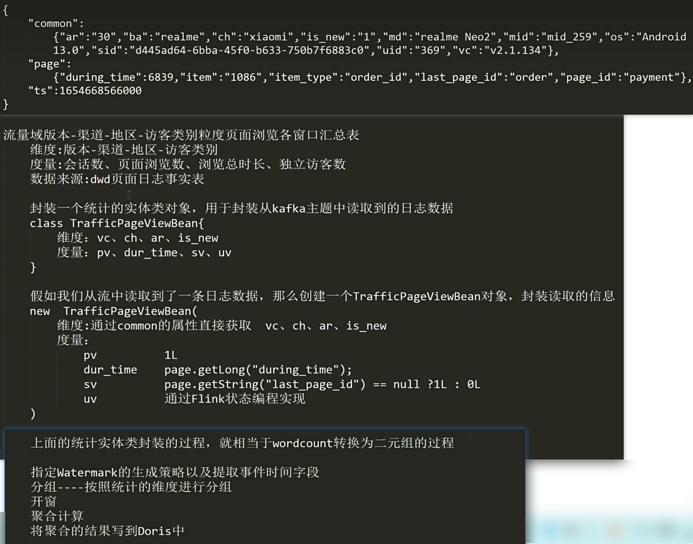

# 概述


# 数据仓库核心架构


# 项目架构


# 注意事项

## 检查点设置

生产环境中，检查点设置在配置文件中配置，而不是在代码中写。


## 批量处理文本

本课程视频 P70：列块模式批量处理文本


# DWD 层

> DWD 和 DIM 表设计依据：业务总线矩阵，行表示一个业务过程，列表示该业务过程所处的环境（维度）。

- 流量域
  - 日志分流
- 交易域
  - 加购事实表
  - 下单事实表
  - 取消订单事实表
  - 支付成功事实表
  - 退单事实表
  - 退款成功事实表
- 互动域
  - 评论事实表
  - 收藏事实表
- 工具域
  - 优惠券领取事实表
  - 优惠券使用事实表
- 用户域
  - 用户注册事实表


## Flink API

流量域的日志分流：P47 - P57

处理逻辑简单的事实表动态分流：P86 - P93


## Flink SQL

> 在 Fink 官网查看：建表语句，连接器

P58 - P85


### 内外连接

代码 `realtime-dwd-interaction-comment-info/.../Test02_SQL_JOIN.java`

- 如果使用普通的内外连接，底层会为参与连接的两张表各自维护一个状态，用于存放两张表的数据，默认情况下，状态永不会失效

- 在生产环境中，一定要设置状态的保留时间。

  - ```java
    tableEnv.getConfig().setIdleStateRetention(Duration.ofSeconds(10));
    ```

- 表状态的最后访问时间更新策略

  - ```java
                        左表                    右表
    内连接         OnCreateAndWrite        OnCreateAndWrite
    左外连接       OnReadAndWrite          OnCreateAndWrite
    右外连接       OnCreateAndWrite        OnReadAndWrite
    全外连接       OnReadAndWrite          OnReadAndWrite
    ```


### Lookup 连接

代码 `realtime-dwd-interaction-comment-info/.../Test03_Demo.java`

- Lookup Join 它的底层实现原理和普通的内外连接是完全不同，没有为参与连接的两张表维护状态
- 它是左表进行驱动的，当左表数据到来的时候，发送请求和右表进行关联


# DWS 层

> DWS 表设计依据：指标体系

- 汇总表抽取：把指标体系中，统计周期、统计粒度、业务过程相同的多个指标，放在一张汇总表里进行处理

- 轻度聚合：往汇总表写数据时，开一个窗口，对当前窗口中的数据做聚合。（此处的开窗聚合对时效性有影响）


## Doris

P95 - P110


## 1 流量域搜索关键词粒度页面浏览各窗口汇总表

P111 - P119

> Flink SQL 实现


## 2 流量域版本-渠道-地区-访客类别粒度页面浏览各窗口汇总表

P120 - P125

> Flink API 实现


### 实现思路




### 开发思路


> 开窗：P123

水位线 = 事件时间 - 乱序程度 - 1ms

窗口最大时间 = 窗口结束时间 - 1ms

窗口触发计算时机：水位线 >= 窗口最大时间

窗口关闭时机：水位线 >= 窗口最大时间 + 允许迟到时间

```java
//6.开窗
//以滚动事件时间窗口为例，分析如下几个窗口相关的问题
//窗口对象什么时候创建:当属于这个窗口的第一个元素到来的时候创建窗口对象
//窗口的起始结束时间（窗口为什么是左闭右开的）
//向下取整：long start =TimeWindow.getWindowStartWithOffset(timestamp, (globalOffset + staggerOffset) % size, size);
//窗口什么时候触发计算  window.maxTimestamp() <= ctx.getCurrentWatermark()
//窗口什么时候关闭     watermark >= window.maxTimestamp() + allowedLateness
WindowedStream<TrafficPageViewBean, Tuple4<String, String, String, String>, TimeWindow> windowDS = dimKeyedDS.window(TumblingEventTimeWindows.of(org.apache.flink.streaming.api.windowing.time.Time.seconds(10)));
```


## 3 流量域首页、详情页页面浏览各窗口汇总表

P126 - P127

### 开发思路


## 4 用户域用户登录各窗口汇总表

P128 - P129

pv：page view 页面访问数

uv：unique visitor 独立访客数（设备）

uu：unique user 独立用户数

### 开发思路


## 6 交易域加购各窗口汇总表

P130 - P131

### 开发思路


## 9 交易域SKU粒度下单各窗口汇总表

P132 - P157

### 实现思路


### 开发思路


## 10 交易域省份粒度下单各窗口汇总表

### 实现思路


### 开发思路


# ADS 层

>从 DWS 表中读取数据做统计分析，即按照某一些维度列对度量列进行统计。


## 环境准备


## 总交易额统计


## 省份交易额统计


## 渠道独立访客数统计


## 总交易额实时展示


# 总结

P184