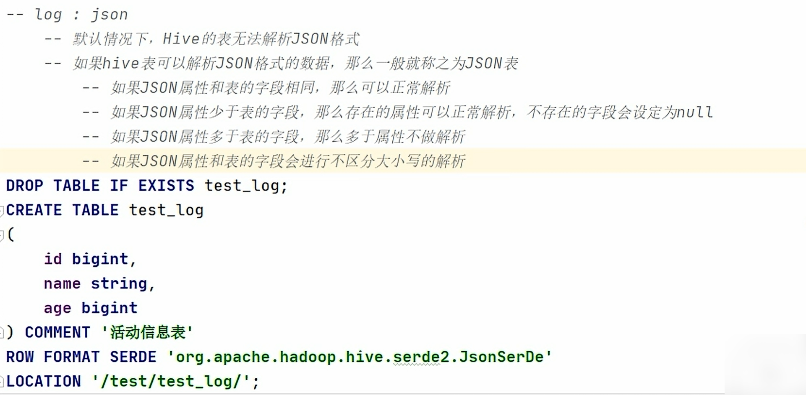
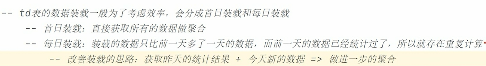

# 概念

## 技术课程&项目课程


## 采集项目&数据仓库项目


## 数据库&数据仓库

1、从名称上进行区分

数据库：database（基础、核心的数据）

数据仓库：Data Warehouse（Warehouse ：货栈，大商店）


## 数据同步


# 架构

## 数据流转过程


## 统计分析的基本步骤


## 数据源


## 数据采集和数据仓库


# 数据采集

## 数据分类

用户行为数据：日志文件

业务数据：数据库

爬虫数据：通过技术手段获取其他公司网站的数据


## 用户行为日志

行为信息，环境信息

埋点方式：代码埋点（前端/后端）、可视化埋点、全埋点

日志内容：页面浏览记录、动作记录、曝光记录、启动记录、错误记录

日志格式：页面日志，启动日志


## 项目需求

### 采集平台

​	（1）用户行为数据采集平台搭建

​	（2）业务数据采集平台搭建

### 离线需求

​		电商离线指标体系


### 实时需求

​		电商实时指标体系


## 项目框架

### 技术选型


### 数据流转架构


### 框架版本选型


### 服务器选型


### 集群规模


### 集群资源规划设计


## 数据采集模块

Linux(N)

JDK

Flume 日志采集

Kafka(Zookeeper)

Hadoop

MySQL 业务数据库

Maxwell 表增量数据同步

DataX 表全量数据同步


### 日志数据采集


### 增量同步业务数据

增量表的数据操作分为2步

1. 第一天执行称之为首日执行
   - 全量数据同步（maxwell - bootstrap）
2. 除了第一天以后的每一天执行称之为每日执行
   - 增量数据同步（maxwell - insert, update, delete）


### 全量同步业务数据

一、全量同步业务数据的最笨思路

1. 确定全量同步的表，然后对每一张表生成对应的 Datax 配置文件 xxx.json 

2. 启动 Datax 作业一张一张进行全量同步

二、全量同步业务数据的智能思路

1. 先针对全量表中的一张表做一个调研，发现有一些配置是固定，如果有 xxx.json 模板生成器，能够将
   一些动态变化的元素通过配置的形式来制定。

2. 通过 xxx.json 模板生成器生成全量表的所有对应的 json 文件

3. 通过一个自动化脚本一次性执行上面生成的所有 xxx.json 


### 采集项目整体流程


## 采集项目总结

一、整个项目概念理解（熟悉了解业务）

- 采集概念：大数据处理集合最前的流程，将相关业务的源头数据采集到大数据平台。

- 业务背景的理解：电商平台数据作为业务背景。

- 采集的数据进行分类

  - 用户行为数据（用户在平台进行购物过程中通过前端埋点产生的种种行为数据，页面浏览记录，动作记录，曝光记录...  平台的后端会将行为数据保存至日志服务器中）

  - 业务数据（用户针对商品购买过程中进行crud所产生的的各种数据）


二、搭建采集项目的平台环境

- 技术选型

- 服务器选型，集群规模的预判
- 版本的选型
- 平台服务的规划设计


三、采集项目用到的框架

- Hadoop
- Flume 
- Maxwell、Datax
- Kafka
- Zookeeper


四、规划采集通管情况

- 用户行为数据 

  - Flume（TailDirSource监控用户行为数据） --> Kafka(将数据先采到Kafka)
     --> Flume（KafkaSource监控用户行为数据）--> HDFS

- 业务数据 

  - 全量（同步指定时间之前的所有数据）

    - datax 

  - 增量（首次同步用全量，之后只同步变化的数据）维度表

    - maxwell

    - 先将数据同步Kafka --> 通过Flume同步到HDFS	  


# 数据仓库

框架和系统的区别？

- 侧重点

  框架：补充完整（底层，原理，融合）

  系统：使用 API（底层，原理，优化）

数据仓库：系统（底层，原理，源码），不同于上述的系统（别人开发的），数据仓库是自己开发的


## 分层架构


- Spark计算过程中，存在shuffle的操作，而shuffle会将计算过程一分为二，分为2个阶段（Stage）

  从计算流程来讲，前一个阶段如果不执行完，后一个阶段不允许执行

- 数据仓库中的不同步骤也存在同样的情况，前面的步骤不执行完，后面的步骤不允许执行

  数据仓库中不称之为阶段，称之为层，每一层就有自己的名称以及对应的逻辑和概念


**ODS 层**


**DWD 层**


**DWS 层**


**ADS 层**


**DIM 层**


**任务调度器**


## 学习重点

1. 建表（建模）

2. SQL

   枯燥，重复性特别强

3. 任务调度器


## 建模方法论

方法论：方法和理论

1. ER 模型
2. 维度模型


### ER 模型

Entity（实体）  Relationship（关系）-->  实体关系模型

使用面向对象的方式来设计数据库的表


**对象关系**

- 多对一：学生和老师 
- 一对多：老师和学生
- 一对一：用户的基本信息和用户的详细信息
- 多对多：学生和课程


**范式理论**

目的是：减少数据冗余，增强数据的一致性

- 函数依赖的三种分类
  - 完全函数依赖
  - 部分函数依赖
  - 传递（间接）函数依赖
- 三范式
  - 第一范式：属性不可切割
  - 第二范式：不能存在部分函数依赖
  - 第三范式：不能存在传递函数依赖


> ER 模型不适合数据仓库的建模操作


### 维度模型

维度模型 ： 所谓的维度就是分析数据的角度

数据统计：汇总的数据（表）-->  行为所产生结果	【事实表】

数据分析：角度（表）-->  状态	【维度表】


## 运行环境

Hive 是工具，不是系统也不是框架

HelloWorld  =>  java HelloWorld  => JVM  =>Process  => Application

SQL(Code)  =>  【Hive  =>  MR(Spark)  =>  jar】(Tool)  =>  Yarn(Run)


Shark

Hive On Spark  =>  (HQL)  Hive 解析 SQL  =>  Spark RDD  =>  jar  =>  Yarn

Spark On Hive  =>  (SparkSQL)  Spark 解析 SQL  =>  Spark RDD  =>  jar  =>  Yarn


## 开发环境

DataGrip


# 数仓分层

## ODS 层

### 设计要点

**Operate Data Store**

- 存储从 mysql 业务数据库和日志服务器的日志文件中采集到的数据
  - 日志数据
    - 格式： JSON
  - 业务数据
    - 历史数据
    - 格式：
      - 全量 Datax：TSV
      - 增量 Maxwell：JSON

- 汇总数据
  - 希望用最少的资源存储最多的数据
    - 压缩：gzip
      - gzip：Hadoop 默认支持的，压缩率（空间）极高，压缩效率（时间）不高
      - lzo：Hadoop 默认不支持的，压缩效率高，压缩率高
      - snappy：Hadoop 默认不支持的，压缩效率极高，压缩率不高
  - 数据存储格式尽可能不变：行式存储（json, tsv）
  - 压缩格式尽可能不变：gzip

**命名规范**

- 在数据仓库中，表都是放置在一起的。从逻辑上进行区分，进行分层
- 表从名称上区分每一层
- 分层标记（ods） +  同步数据的表名称  +  全量/增量标识（full/inc）


### 日志表

- 表的数据就是同步过来的日志数据
  - 页面浏览日志：JSON
  - APP 启动日志：JSON
- ods_log_inc
  - 字段
- 建表语句
  - EXTERNAL 外部表
  - LOCATION 位置
  - 分区表
  - Json 表
- 日志数据格式
  - 页面浏览日志
    - JSON 中含有 JSON
      - JSON 表中的 JSON 数据如果存在嵌套的情况，一般会将最外层的 JSON 对象的属性作为 JSON 表的字段
      - common, actions, displays, page, err, ts
    - 表的字段类型应该采用特殊类型
  - APP 启动日志
    - JSON 中含有 JSON
      - common, start, err, ts


**分区表**


**Json 表**




**特殊类型：array, map, struct**

```sql
CREATE TABLE test_datatype
(
	ids array<int>,
    dat map<string, string>,
    obj struct<id:int, name:string>
) COMMENT '日志表'
LOCATION '/test/test_datatype/';
```


- array 集合
  - 显示效果 [ ]
  - 采用 `数组[索引]` 的方式进行访问
  - 如果索引超出范围，并不会发生错误，而是直接返回 null

```sql
select
	ids,
	ids[1],
	ids[5],
	array(ids[1], ids[2]),
	array_contains(ids, 'e'),
	array_contains(ids, 'c')
from (
	select array('a', 'b', 'c', 'd') ids
) t
where array_contains(ids, 'e');
```


- map 集合
  - 显示效果类似于 JSON 对象
  - 采用 `map[key]` 的方式进行访问，如果 key 不存在，直接返回 null

```sql
select
	dat,
	dat['a'],
	map_keys(dat),
	map_values(dat),
	if (array_contains(map_keys(dat), 'c'), 3, 4)
from (
	select map('a', 1, 'c', 2) dat
) t;
```


- struct 对象
  - 显示效果类似于 JSON 对象
  - 访问对象中存在的属性时，采用点的方式
  - 访问对象中不存在的属性时，会直接发生错误

```sql
-- struct() 会将所有数据作为属性值
select struct('a', 'b', 'c');

select
	obj,
	obj.a
from (
	select named_struct('a', 'b', 'c', 1) obj
)
```


- map 和 struct 的区别
  - 泛型
  - struct 中的属性名称是固定的，只要约束好不能发生变化
  - map 中的 key 不是固定的，可以动态判断


### 业务表

- 全量表
  - DataX
  - TSV
    - mysql：column[id, name, age]
    - data：1001    zhangsan    30
    - hive：column[id, name, age]
  - 表结构和业务表保持一致即可
- 增量表
  - Maxwell 
  - JSON
  - 最外层 JSON 对象的属性作为表的字段


## DIM 层

### 设计要点


### 维度建模-维度表


### 商品维度表


**字段分析**


**建表语句**


**数据装载**


### 优惠券维度表


### 活动维度表


### 地区维度表


### 营销坑位维度表


### 营销渠道维度表


### 日期维度表


### 用户维度表

**拉链表**


## DWD 层

### 设计要点


### 事实表


### 交易域加购事务事实表


**数据装载**


### 交易域下单事务事实表

下单：用户 + 时间 + 商品 + 订单 + 商品数量 + 商品金额


### 交易域支付成功事务事实表

支付成功：用户 + 时间+ 订单  + 商品 + 支付金额


### 交易域购物车周期快照事实表

- 周期快照事实表
  - 特殊的需求：各品类商品购物车存量
  - 实现思路：行为数据（事实表）+  状态数据（维度表）
  - 其实特殊的需求不需要特殊的计算，因为效率太低，可以直接从业务数据中获取特殊字段（比如存量）。
    - 特殊字段不需要进行多张表的关联计算，直接从业务数据库中周期性地获取即可


### 交易域交易流程累积快照事实表

- 累积快照事实表
  - 特殊的需求：下单到支付时间间隔平均值
  - 将一个流程中的多个行为状态数据累积在一张表中


**数据装载**


**分区策略**


### 工具域优惠券使用(支付)事务事实表

优惠券使用(支付)：用户 + 时间 + 订单 + 优惠券 + （次数）


### 互动域收藏商品事务事实表

收藏商品：用户 + 时间 + 商品


### 流量域页面浏览事务事实表

- 页面浏览：用户 + 时间 + 上一个页面 + 当前页面 + （次数）+ 停留时间

- Session：会话
  - 所谓的会话，其实就是数据通信状态
    - 通信过程中，如果通信双方在某一个时间段都没有发送任何的消息，通信状态就会失效，会话会终止
  - 页面访问其实是和会话相关的
    - 如果在统计连续页面的访问时，需要考虑会话的区别


### 用户域用户注册事务事实表

用户注册成功：用户（会员） + 时间  


### 用户域用户登录事务事实表

- 用户登录成功：用户 + 时间  + （次数）

- 登录操作取自日志。一次会话是指从打开 App 到关闭 App 的一次完整业务流程。会话内第一个 uid 不为 null的页面就对应一次登录操作。


## DWS 层

### 设计要点

- 预聚合，保存中间计算结果
- 中间计算结果表不是最终结果表
  - 数据量大：增加分区
  - 需要进一步的计算
    - 存储方式：orc 列式存储
    - 压缩方式：snappy
- 命名规范：dws _ 数据域 _ 统计粒度 _ 业务过程 _ 统计周期（1d/nd/td）


### 交易域用户商品粒度订单最近1日汇总表

交易域

用户商品粒度：user + sku

订单：下单行为

最近1日汇总表：数据范围 1d


### 交易域用户商品粒度订单最近n日汇总表

nd 表的数据装载基本思路

1. 读取最大范围的数据：30d
2. 同时计算不同时间范围 (7d, 30d) 的数据：sum(if) 有条件的求和


### 交易域用户粒度订单最近1日汇总表

交易域

用户商品粒度：user

订单：下单行为

最近1日汇总表：1d


### 统计粒度的变化

中间表 (DWS) ---> ADS

当前的统计粒度减少，并且就是对减少的那个粒度做统计，此时无需判重

当前的统计粒度减少，对其他字段进行进一步统计，需要聚合数据

当前的统计粒度发生变化，此时必须判重

当前的统计粒度发生变化，对其他字段进行进一步统计，需要聚合数据

粒度没有变化，可以直接将中间表的数据获取后使用


### 交易域用户粒度订单历史至今汇总表




### 交易域用户粒度加购最近1日汇总表


### 交易域用户粒度支付最近1日汇总表


### 交易域省份粒度订单最近1日汇总表


### 交易域省份粒度订单最近n日汇总表


### 工具域用户优惠券粒度优惠券使用(支付)最近1日汇总表


### 互动域商品粒度收藏商品最近1日汇总表


### 流量域会话粒度页面浏览最近1日汇总表


### 流量域访客页面粒度页面浏览最近1日汇总表


### 用户域用户粒度登录历史至今汇总表


## ADS 层

### 介绍


### 炸裂函数


### 各渠道流量统计


### 路径分析


### 用户变动统计


### 用户留存率


### 用户新增活跃统计


### 用户行为漏斗分析


### 新增下单用户统计

- 如果将一个表的所有数据获取之后，再进行统计，那么这张表称之为历史至今表（td表）

- nd 表的问题
  - nd 表计算时可能出现的问题：30天内有数据，但是7天内没有数据。但是7天和30天会融合成一条


### 最近7日内连续3日下单用户数


### 最近30日各品牌复购率


### 各品牌商品下单统计

- 各品牌商品下单统计

  - 统计的行为：下单

  - 分析的角度：品牌

  - 指标：下单数量，下单人数


### 各品类商品下单统计

- 性能如何提升？
  - join
  - 可以减少数据量
  - 存在重复计算
  - 数据重复读取

- 优化思路

  - 存在重复计算

    1. 将最近1天的数据保存到一张表中

    2. 最近7天和最近30天数据从最近1天的统计表中获取数据，进行进一步的计算

  - 数据重复读取

    1. 获取时间范围最大的数据集

    2. 将查询的数据集在内存中进行炸裂操作（3份），变成多份
    3. 将炸裂后的数据进行筛选过滤，保留有效数据
    4. 将过滤后的数据按照标记进行分组，然后统计

  

### 各品类商品购物车存量Top3


### 各品牌商品收藏次数Top3


### 下单到支付时间间隔平均值


### 各省份交易统计


### 优惠券使用统计


## 总结

- ODS层：作为整个数据仓库的数据源

- DIM层，DWD层：作为统计分析的数据源
  - DIM层：根据数据的状态，对统计结果进行分析
  - DWD层：根据行为产生的数据，进行统计
- 数据准备：当前学习的模拟环境，并不是真实环境


# 数据仓库设计

## 数据仓库分层规划


## 数据仓库构建流程


### 1 数据调研

- 业务调研
  - 熟悉业务流程
    - 将该业务所包含的每个业务过程一一列举出来
  - 熟悉业务数据
    - 将数据（包括埋点日志和业务数据表）与业务过程对应起来

- 需求分析
  - 明确需求所需的业务过程及维度


### 2 明确数据域

一个业务过程只能属于一个数据域


### 3 构建业务总线矩阵

矩阵的行是一个个业务过程，矩阵的列是一个个的维度，行列的交点表示业务过程与维度的关系。


### 4 明确统计指标

**指标体系**

（1）原子指标

原子指标包含三要素，分别是业务过程、度量值和聚合逻辑。

（2）派生指标


（3）衍生指标


### 5 维度模型设计

维度模型的设计参照上述得到的业务总线矩阵即可。事实表存储在 DWD 层，维度表存储在 DIM 层。


### 6 汇总模型设计

汇总模型的设计参考上述整理出的指标体系（主要是派生指标）即可。

汇总表与派生指标的对应关系是，一张汇总表通常包含业务过程相同、统计周期相同、统计粒度相同的多个派生指标。

汇总表与事实表的对应关系是：一张汇总表对应一张事实表。


# 任务调度

